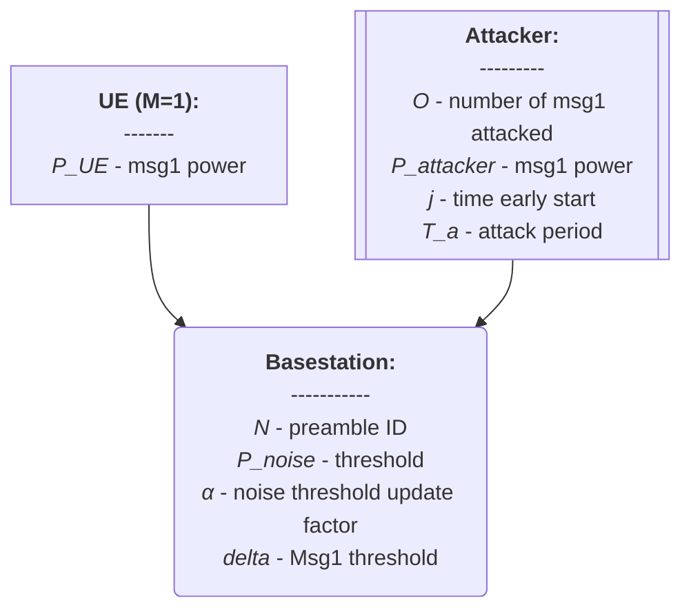

# prach-attack-analysis

**References:**
- [Modeling and Estimation of One-Shot Random Access for Finite-User Multichannel Slotted ALOHA Systems](https://ieeexplore.ieee.org/document/6211364)

**System Model:**

**Repository Structure:**
```
prach-attack-analysis
├── docs    : Notes for the thesis development
├── expe    : source code for experiment results
├── math    : source code for mathemathical model
├── simu    : source code for simulation
```
