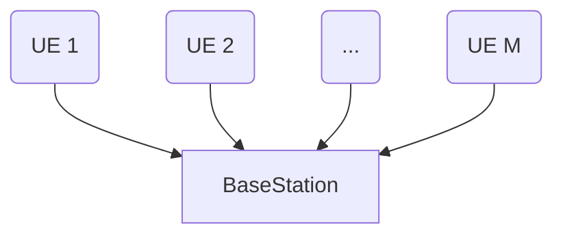
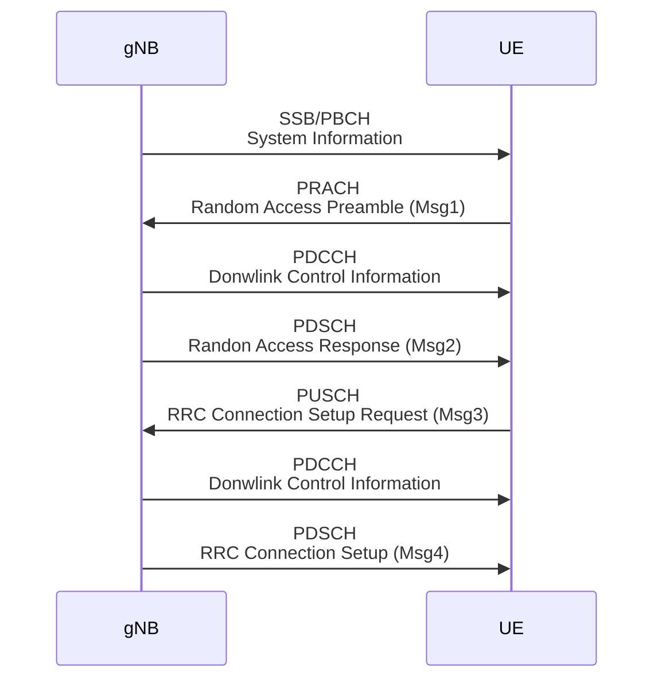

# 20250227 Thesis (Basic Collision Model)

###### tags: `2025`

**Goal:**
- [x] Write Basic Collision Model for Analysis of PRACH Attack on Network Energy Saving

**References:**
- Modeling Random Access with Capture and Power Control for IEEE 802.11be Systems
- [Modeling and Estimation of One-Shot Random Access for Finite-User Multichannel Slotted ALOHA Systems](https://ieeexplore.ieee.org/document/6211364)

**Table of Contents:**
- [20250227 Thesis (Basic Collision Model)](#20250227-thesis--basic-collision-model-)
          + [tags: `2025`](#tags---2025-)
  * [1. Define UE and PRACH parameters](#1-define-ue-and-prach-parameters)
    + [1.1. System Model](#11-system-model)
    + [1.2. 5G PRACH](#12-5g-prach)
    + [1.3. PRACH parameters](#13-prach-parameters)
  * [2. Model Collision Probability in PRACH by Approximation](#2-model-collision-probability-in-prach-by-approximation)
    + [2.1. Model Parameters](#21-model-parameters)
    + [2.2. Equation](#22-equation)
  * [3. Model Implementation in Python Code](#3-model-implementation-in-python-code)
    + [3.1. Code based on original Paper](#31-code-based-on-original-paper)
      - [3.1.1. Parameters](#311-parameters)
      - [3.1.2. Code](#312-code)
      - [3.1.3. Result](#313-result)

<small><i><a href='http://ecotrust-canada.github.io/markdown-toc/'>Table of contents generated with markdown-toc</a></i></small>

## 1. Define UE and PRACH parameters

### 1.1. System Model



### 1.2. 5G PRACH



### 1.3. PRACH parameters

| Category                | Parameter                                                                                                                | Value                                 | 
| ----------------------- | -------------------------------------------------------------------------------------------------------------------------- | ------------------------------------------------- |
| UE RA | ra-ResponseWindow<hr>ra-ContentionResolutionTimer | 10ms<hr>64ms | 
| gNB RO  | ssb-PositionsInBurst<hr>prach-ConfigurationIndex<hr>msg1-FDM<hr>ssb-perRACH-OccasionAndCB-PreamblesPerSSB                                                                    | 1 SSB<hr>159<hr>1 RO<hr>OneAnd60                          | 

## 2. Model Collision Probability in PRACH by Approximation

### 2.1. Model Parameters

| Parameter                | Description                                                                                                                |
| ----------------------- | -------------------------------------------------------------------------------------------------------------------------- | 
| $M$ | number of UEs sending Msg1 | 
| $N_i$ | number of Preambles per SSB for the $i^{th}$ SSB | 
| $N_{C,i}$  | expected value of the preambles that have at least 2 UEs' Msg1                                                                 | 
| $N_{S,i}$  | expected value of the preambles that have only 1 UE's Msg1                                                                 | 
| $K_i$  | Average number of UEs that transmit Msg1 in the $i^{th}$ SSB. Initially, $K_1 = M$                                                                 | 
| $P_S$  | probability of successfull Msg1 complete reception by gNB within maximum number of SSB $I_{max}$                                                                | 
| $P_C$  | ratio between the number of collided preamble and the overall number of preamble in the period of $I_{max}$ SSB                                                                 | 

### 2.2. Equation

1. Expected value of the number of preambles that have only 1 UE's Msg1 for the first SSB
```math
N_{S,1} = M e^{-M/N_1}
```

2. Expected value of the number of preambles that have at least 2 UEs' Msg1 for the first SSB
```math
N_{C,1} = N_1 - M e^{-M/N_1} - N_1 e^{-M/N_1}
```

3. Expected value of successfull preamble per SSB
```math
N_{S,i} = K_i e^{-K_i/N_i}
```

4. Average number of UEs that transmit Msg1 in the $i^{th}$ SSB. Initially, $K_1 = M$
```math
K_{i+1} = K_i - N_{S,i} = K_i ( 1 - e^{-K_i/N_i})
```

5. Access success probability, $P_S$, = probability of successfull Msg1 complete reception by gNB within maximum number of SSB $I_{max}$
```math
P_S = \sum_{i=1}^{I_{\text{max}}} \frac{N_{S,i}}{M}
```

6. Collision probability, $P_C$ , = ratio between the number of collided preamble and the overall number of preamble in the period of $I_{max}$ SSB
```math
P_C = \frac{\sum_{i=1}^{I_{\text{max}}} N_{C,i}}{\sum_{i=1}^{I_{\text{max}}} N_i}
```

7. Mean access delay, $T_a$, = delay for each Msg1 reception process between the UE's first Msg1 attempt and the success reception of the UE's Msg1 in gNB
```math
T_a = \left( \sum_{i=1}^{I_{\text{max}}} i \times N_{S,i} \right) / \sum_{i=1}^{I_{\text{max}}} N_{S,i}
```

## 3. Model Implementation in Python Code

### 3.1. Code based on original Paper

#### 3.1.1. Parameters

| Parameter                | Value                                                                                                                |
| ----------------------- | -------------------------------------------------------------------------------------------------------------------------- | 
| $M$ | 100 | 
| $N$ | 5~45 | 
| $I_{max}$  | 10                                                                 | 


#### 3.1.2. Code

```python
import numpy as np
import matplotlib.pyplot as plt

def compute_PC_PS_TA(M=100, I_max=10, N_values=range(5, 46)):
    P_C_list = []
    P_S_list = []
    T_A_list = []
    
    for N in N_values:
        K_i = M  # Initially, all UEs attempt Msg1
        N_C_total = 0
        N_S_total = 0
        N_total = 0
        weighted_sum_TA = 0
        
        for i in range(1, I_max + 1):
            N_S_i = K_i * np.exp(-K_i / N)  # Expected successful preambles
            N_C_i = N - N_S_i - (N * np.exp(-K_i / N))  # Collided preambles
            
            N_S_total += N_S_i
            N_C_total += N_C_i
            N_total += N
            weighted_sum_TA += i * N_S_i  # Weighted sum for Ta calculation
            
            K_i = K_i - N_S_i  # Remaining UEs after success
        
        P_C = N_C_total / N_total  # Collision probability
        P_S = N_S_total / M  # Access success probability
        T_A = weighted_sum_TA / N_S_total if N_S_total > 0 else 0  # Average access delay
        
        P_C_list.append(P_C)
        P_S_list.append(P_S)
        T_A_list.append(T_A)
    
    return N_values, P_C_list, P_S_list, T_A_list

# Compute values
N_values, P_C_list, P_S_list, T_A_list = compute_PC_PS_TA()

# Plot PC graph
plt.figure(figsize=(18, 5))
plt.subplot(1, 3, 1)
plt.plot(N_values, P_C_list, marker='o', linestyle='-', color='r', label='P_C')
plt.xlabel('Number of Preambles (N)')
plt.ylabel('Collision Probability (P_C)')
plt.title('Collision Probability vs Number of Preambles')
plt.ylim(0, 1)
plt.grid(True)
plt.legend()

# Plot PS graph
plt.subplot(1, 3, 2)
plt.plot(N_values, P_S_list, marker='s', linestyle='-', color='b', label='P_S')
plt.xlabel('Number of Preambles (N)')
plt.ylabel('Access Success Probability (P_S)')
plt.title('Access Success Probability vs Number of Preambles')
plt.ylim(0, 1)
plt.grid(True)
plt.legend()

# Plot TA graph
plt.subplot(1, 3, 3)
plt.plot(N_values, T_A_list, marker='^', linestyle='-', color='g', label='T_A')
plt.xlabel('Number of Preambles (N)')
plt.ylabel('Average Access Delay (T_A)')
plt.title('Average Access Delay vs Number of Preambles')
plt.ylim(0, 10)
plt.grid(True)
plt.legend()

plt.tight_layout()
plt.show()
```

#### 3.1.3. Result

