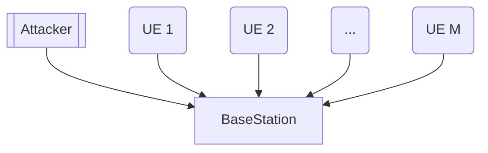
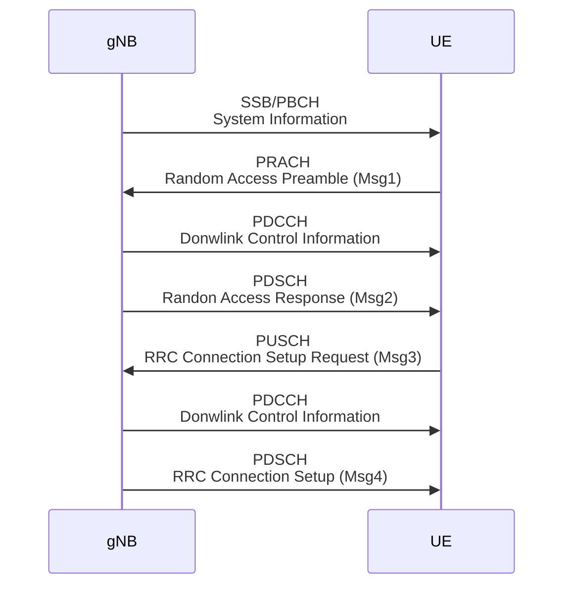

# 20250227 Thesis (Basic Collision Model)

###### tags: `2025`

**Goal:**
- [x] Write Incorporate Attacker Collision Model for Analysis of PRACH Attack on Network Energy Saving

**References:**
- Modeling Random Access with Capture and Power Control for IEEE 802.11be Systems
- [Modeling and Estimation of One-Shot Random Access for Finite-User Multichannel Slotted ALOHA Systems](https://ieeexplore.ieee.org/document/6211364)
- [20250227 Thesis (Basic Collision Model)](https://github.com/bmw-ece-ntust/prach-attack-analysis/blob/master/docs/20250227%20Thesis%20(Basic%20Collision%20Model).md)

**Table of Contents:**
- [20250227 Thesis (Basic Collision Model)](#20250227-thesis--basic-collision-model-)
          + [tags: `2025`](#tags---2025-)
  * [1. Define UE and PRACH parameters](#1-define-ue-and-prach-parameters)
    + [1.1. System Model](#11-system-model)
    + [1.2. 5G PRACH](#12-5g-prach)

<small><i><a href='http://ecotrust-canada.github.io/markdown-toc/'>Table of contents generated with markdown-toc</a></i></small>

## 1. Define UE and PRACH parameters

### 1.1. System Model

### 1.2. 5G PRACH

