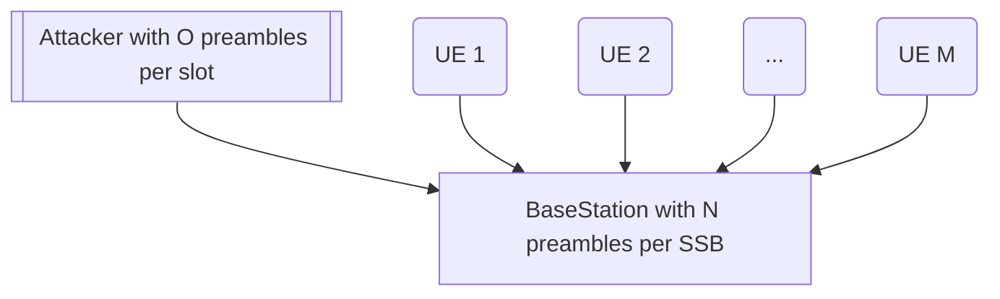
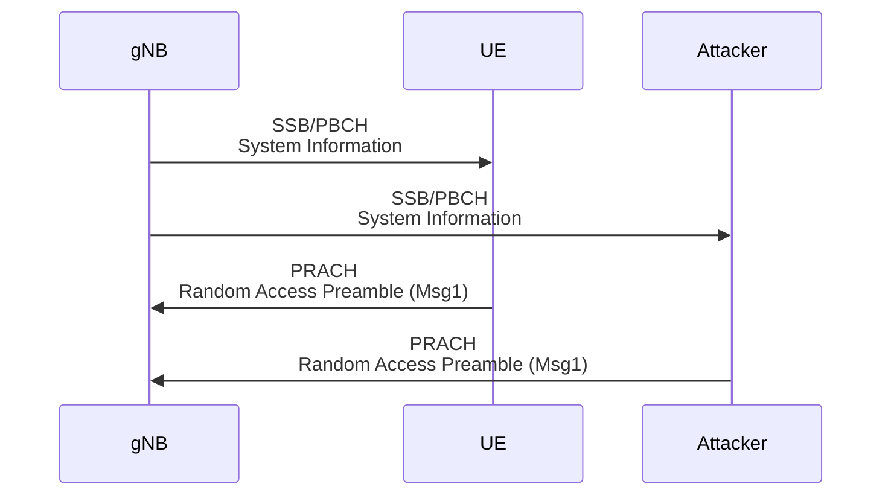
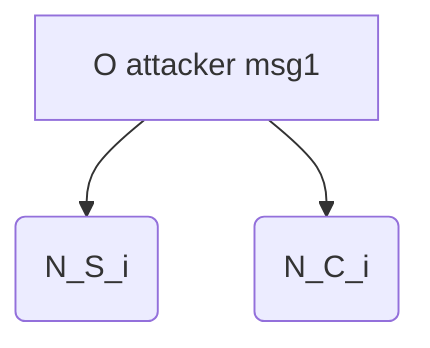

# 20250304 Thesis (Incorporate Attacker into Collision Model)

###### tags: `2025`

**Goal:**
- [x] Write Incorporate Attacker Collision Model for Analysis of PRACH Attack on Network Energy Saving

**References:**
- Modeling Random Access with Capture and Power Control for IEEE 802.11be Systems
- [Modeling and Estimation of One-Shot Random Access for Finite-User Multichannel Slotted ALOHA Systems](https://ieeexplore.ieee.org/document/6211364)
- [20250227 Thesis (Basic Collision Model)](https://github.com/bmw-ece-ntust/prach-attack-analysis/blob/master/docs/20250227%20Thesis%20(Basic%20Collision%20Model).md)

**Table of Contents:**
- [20250304 Thesis (Incorporate Attacker into Collision Model)](#20250304-thesis--incorporate-attacker-into-collision-model-)
          + [tags: `2025`](#tags---2025-)
  * [1. Add 1 Attacker for Msg1](#1-add-1-attacker-for-msg1)
    + [1.1. System Model](#11-system-model)
    + [1.2. 5G PRACH](#12-5g-prach)
    + [1.3. Notes and Assumptions](#13-notes-and-assumptions)
  * [2. Model Collision Probability in PRACH by Approximation with Attacker](#2-model-collision-probability-in-prach-by-approximation-with-attacker)
    + [2.1. Model Parameters](#21-model-parameters)
    + [2.2. Equation](#22-equation)
    + [2.3. Code](#23-code)
      - [2.3.1. Parameters](#231-parameters)
      - [2.3.2. Code](#232-code)
      - [2.3.3. Result](#233-result)

<small><i><a href='http://ecotrust-canada.github.io/markdown-toc/'>Table of contents generated with markdown-toc</a></i></small>

## 1. Add 1 Attacker for Msg1

### 1.1. System Model



### 1.2. 5G PRACH



### 1.3. Notes and Assumptions

1. Attacker send preamble to every RO
2. Fixed preamble index sent by the attacker

## 2. Model Collision Probability in PRACH by Approximation with Attacker

### 2.1. Model Parameters

| Parameter | Description                                                                                                     |
| --------- | --------------------------------------------------------------------------------------------------------------- |
| $M$       | number of UEs sending Msg1                                                                                      |
| $N$     | total number of Preambles per SSB                                                                |
| $N_i$     | number of Preambles per SSB for the $i^{th}$ SSB                                                                |
| $N_{C,i}$ | expected value of the preambles that have at least 2 UEs and/or attacker's Msg1                                                  |
| $N_{S,i}$ | expected value of the preambles that have only 1 UE or attacker's Msg1                                                      |
| $\hat{N}_{S,i}$ | expected value of the preambles that have only 1 UE's Msg1                                                      |
| $K_i$     | Average number of UEs that transmit Msg1 in the $i^{th}$ SSB. Initially, $K_1 = M$                              |
| $P_S$     | probability of successfull Msg1 complete reception by gNB within maximum number of SSB $I_{max}$                |
| $P_C$     | ratio between the number of collided preamble and the overall number of preamble in the period of $I_{max}$ SSB |
| $P_{noise,i}$     | gNB noise power threshold for the $i^{th}$ SSB |
| $P_{msg1,i}$     | UEs and attacker's power received on the gNB for the $i^{th}$ SSB |


### 2.2. Equation

0. Equations from Basic Collision Model [4.2](https://github.com/bmw-ece-ntust/prach-attack-analysis/blob/master/docs/20250227%20Thesis%20(Basic%20Collision%20Model).md#42-equation) are still used but some are modified to incorporate attacker

1. Expected value of the number of preambles that have only 1 UE or attacker's Msg1 for the $i^{th}$ SSB
```math
N_{S,i} = (K_i + 1) e^{-(K_i + 1)/N_i}
```

2. Expected value of the number of preambles that have at least 2 UEs and/or attacker's Msg1 for the $i^{th}$ SSB
```math
N_{C,i} = N_i - (K_i + 1) e^{-(K_i + 1)/N_i} - N_i e^{-(K_i + 1)/N_i}
```

3. $N_{S,i}$ should be transformed to `$\hat{N}_{S,i}$` according to whether attacker's Msg1 is inside $N_{S,i}$ or $N_{C,i}$
```math
\hat{N}_{S,i} =
\begin{cases} 
N_{S,i}-1, & \text{if attacker msg1 inside } N_{S,i} \\ 
N_{S,i}, & \text{otherwise} 
\end{cases}
```
```math
P(\hat{N}_{S,i} = N_{S,i}-1) = \frac{N_{S,i}}{N_{S,i} + N_{C,i}}
```
```math
P(\hat{N}_{S,i} = N_{S,i}) = \frac{N_{C,i}}{N_{S,i} + N_{C,i}}
```
```math
\hat{N}_{S,i} = N_{S,i} - \frac{N_{S,i}}{N_{S,i} + N_{C,i}}
```

4. Average number of UEs that transmit Msg1 in the $i^{th}$ SSB. Initially, $K_1 = M$
```math
K_{i+1} = K_i - \hat{N}_{S,i}
```

### 2.3. Code

#### 2.3.1. Parameters

| Parameter | Value                       | Reference                                            |
| --------- | --------------------------- | ---------------------------------------------------- |
| $M$       | 2                           | Experiment uses MTK and Samsung UE                   |
| $N$       | 60                          | ssb-perRACH-OccasionAndCB-PreamblesPerSSB = OneAnd60 |
| $I_{max}$ | 185 (MTK) and 155 (Samsung) | -                                                    |
| $P_{noise,1}$ | 25 | -                                                    |

#### 2.3.2. Code

```python
import numpy as np
import matplotlib.pyplot as plt

def compute_PC_PS_TA(M=2, I_max=155, N=60):
    P_C = 0
    P_S = 0
    T_A = 0
    N_i = 0
    N_S_i_list = []
    N_hat_S_i_list = []
    N_C_i_list = []
    K_i_list = []
    i_list = []
    
    K_i = M  # Initially, all UEs attempt Msg1
    P_msg1_i = 50
    P_noise_i = 25
    N_C_total = 0
    N_S_total = 0
    N_total = 0
    weighted_sum_TA = 0
    
    for i in range(1, I_max + 1):
        if (P_msg1_i > P_noise_i):
            N_i = N
        else:
            N_i = 0.000000001
        i_list.append(i)
        K_i_list.append(K_i)
        N_S_i = (K_i + 1) * np.exp(-1 * (K_i + 1) / N_i)
        N_C_i = N_i - N_S_i - (N_i * np.exp(-1 * (K_i + 1) / N_i))  # Collided preambles
        N_hat_S_i = N_S_i - ( N_S_i / (N_S_i + N_C_i) )  # Expected successful preambles
		
        N_S_i_list.append(N_hat_S_i)
        N_C_i_list.append(N_C_i)
        
        N_S_total += N_hat_S_i
        N_C_total += N_C_i
        N_total += N_i
        weighted_sum_TA += i * N_S_i  # Weighted sum for Ta calculation
        
        K_i = K_i - N_hat_S_i  # Remaining UEs after success
        
        if (K_i <= 0):
            P_msg1_i = 0
        
        P_noise_i = 0.9 * P_noise_i + 0.1 * P_msg1_i
    
    P_C = N_C_total / N_total  # Collision probability
    P_S = N_S_total / M  # Access success probability
    T_A = weighted_sum_TA / N_S_total if N_S_total > 0 else 0  # Average access delay
    
    return N, P_C, P_S, T_A, K_i_list, i_list, N_S_i_list, N_C_i_list

# Compute values
N, P_C, P_S, T_A, K_i_list, i_list, N_S_i_list, N_C_i_list = compute_PC_PS_TA()

print("P_C = " + str(P_C) + "\n")

# Plot Ki graph
plt.figure(figsize=(18, 5))
plt.subplot(1, 3, 1)
plt.plot(i_list, K_i_list, marker='o', linestyle='-', color='r', label='K_i')
plt.xlabel('Number of Slots (i)')
plt.ylabel('Remaining UEs (K_i)')
plt.title('Remaining UEs vs Number of Slots')
plt.ylim(0, 5)
plt.grid(True)
plt.legend()

# Plot NSi graph
plt.subplot(1, 3, 2)
plt.plot(i_list, N_S_i_list, marker='o', linestyle='-', color='b', label='N_S_i')
plt.xlabel('Number of Slots (i)')
plt.ylabel('Expected successful preambles (N_S_i)')
plt.title('Expected successful preambles vs Number of Slots')
plt.ylim(0, 5)
plt.grid(True)
plt.legend()

# Plot NCi graph
plt.subplot(1, 3, 3)
plt.plot(i_list, N_C_i_list, marker='o', linestyle='-', color='g', label='N_C_i')
plt.xlabel('Number of Slots (i)')
plt.ylabel('Collided preambles (N_C_i)')
plt.title('Collided preambles vs Number of Slots')
plt.ylim(0, 5)
plt.grid(True)
plt.legend()

plt.tight_layout()
plt.show()
```

#### 2.3.3. Result

$P_C$ = 0


## 3. Extend number of msg1 sent by attacker

### 3.1. Model Parameters

| Parameter | Description                                                                                                     |
| --------- | --------------------------------------------------------------------------------------------------------------- |
| $M$       | number of UEs sending Msg1                                                                                      |
| $N$     | total number of Preambles per SSB                                                                |
| $O$     | total number of dummy Preambles sent by attacker                                                                |
| $N_i$     | number of Preambles per SSB for the $i^{th}$ SSB                                                                |
| $N_{C,i}$ | expected value of the preambles that have at least 2 UEs and/or attacker's Msg1                                                  |
| $N_{S,i}$ | expected value of the preambles that have only 1 UE or attacker's Msg1                                                      |
| $\hat{N}_{S,i}$ | expected value of the preambles that have only 1 UE's Msg1                                                      |
| $K_i$     | Average number of UEs that transmit Msg1 in the $i^{th}$ SSB. Initially, $K_1 = M$                              |
| $P_S$     | probability of successfull Msg1 complete reception by gNB within maximum number of SSB $I_{max}$                |
| $P_C$     | ratio between the number of collided preamble and the overall number of preamble in the period of $I_{max}$ SSB |
| $P_{noise,i}$     | gNB noise power threshold for the $i^{th}$ SSB |
| $P_{msg1,i}$     | UEs and attacker's power received on the gNB for the $i^{th}$ SSB |

### 3.2. Equation

0. Equations from [2.2](#22-equation) should be extended from 1 preamble to $O$ preambles sent by attacker

1. Expected value of the number of preambles that have only 1 UE or attacker's Msg1 for the $i^{th}$ SSB
```math
N_{S,i} = (K_i + O) e^{-(K_i + O)/N_i}
```

2. Expected value of the number of preambles that have at least 2 UEs and/or attacker's Msg1 for the $i^{th}$ SSB
```math
N_{C,i} = N_i - (K_i + O) e^{-(K_i + O)/N_i} - N_i e^{-(K_i + O)/N_i}
```

3. $N_{S,i}$ should be transformed to `$\hat{N}_{S,i}$` according to whether attacker's Msg1 is inside $N_{S,i}$ or $N_{C,i}$

```math
\hat{N}_{S,i} =
\begin{cases} 
N_{S,i} - 0, & \text{if none of attacker msg1 inside } N_{S,i} \\  
N_{S,i}-1, & \text{if 1 attacker msg1 inside } N_{S,i} \\
... \\
N_{S,i} - O, & \text{if O attacker msg1 inside } N_{S,i}
\end{cases}
```
```math
P(\hat{N}_{S,i} = N_{S,i} - 0 = N_{S,i}) = \frac{\binom{N_{S,i}}{0}\times \binom{N_{C,i}}{O} \times \binom{O}{0}}{\sum_{j=0}^{O} \binom{N_{S,i}}{j}\times \binom{N_{C,i}}{O-j} \times \binom{O}{j}}
```
```math
P(\hat{N}_{S,i} = N_{S,i} - 1) = \frac{\binom{N_{S,i}}{1}\times \binom{N_{C,i}}{O-1} \times \binom{O}{1}}{\sum_{j=0}^{O} \binom{N_{S,i}}{j}\times \binom{N_{C,i}}{O-j} \times \binom{O}{j}}
```
```math
\hat{N}_{S,i} = (N_{S,i} - 0)*P(\hat{N}_{S,i} = N_{S,i} - 0) + (N_{S,i} - 1)*P(\hat{N}_{S,i} = N_{S,i} - 1) + ...
```
```math
\hat{N}_{S,i} = \sum_{j=0}^{O} (N_{S,i}-j)\times \frac{\binom{N_{S,i}}{j}\times \binom{N_{C,i}}{O-j} \times \binom{O}{j}}{\sum_{k=0}^{O} \binom{N_{S,i}}{k}\times \binom{N_{C,i}}{O-k} \times \binom{O}{k}}
```
<!--
3a. We can see that `$\hat{N}_{S,i}$` is just $N_{S,i}$ minus the number of attacker's msg1 that fall in $N_{S,i}$. Let $X$ be the number of attacker's msg1 that fall in $N_{S,i}$. Then we can define: 
```math
\hat{N}_{S,i} = N_{S,i} - E[X]
```
3b. Let $Y = E[X]$. Since we know the number of $N_{S,i}$, $N_{C,i}$, and $O$, we can treat $Y$ as a function of $N_{S,i}$, $N_{C,i}$, and $O$ and get a recursive function
```math
p = \frac{N_{S,i}}{N_{S,i} + N_{C,i}}
```
```math
E[X] = Y(N_{S,i}, N_{C,i}, O) = p \times ( 1 + Y(N_{S,i} - 1, N_{C,i}, O-1) ) + (1 - p) \times ( 0 + Y(N_{S,i}, N_{C,i} - 1, O-1) )
```
```math
Y(N_{S,i}, N_{C,i}, O) =
\begin{cases} 
O, & \text{if } Y(N_{S,i}, 0, O) \\
0, & \text{if } Y(0, N_{C,i}, O) \\
0, & \text{if } Y(N_{S,i}, N_{C,i}, 0) \\
p \times ( 1 + Y(N_{S,i} - 1, N_{C,i}, O-1) ) + (1 - p) \times Y(N_{S,i}, N_{C,i} - 1, O-1), & \text{otherwise}
\end{cases}
```
-->


4. Average number of UEs that transmit Msg1 in the $i^{th}$ SSB. Initially, $K_1 = M$
```math
K_{i+1} = K_i - \hat{N}_{S,i}
```
