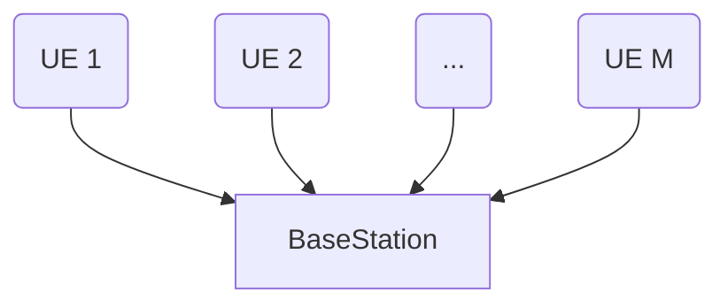
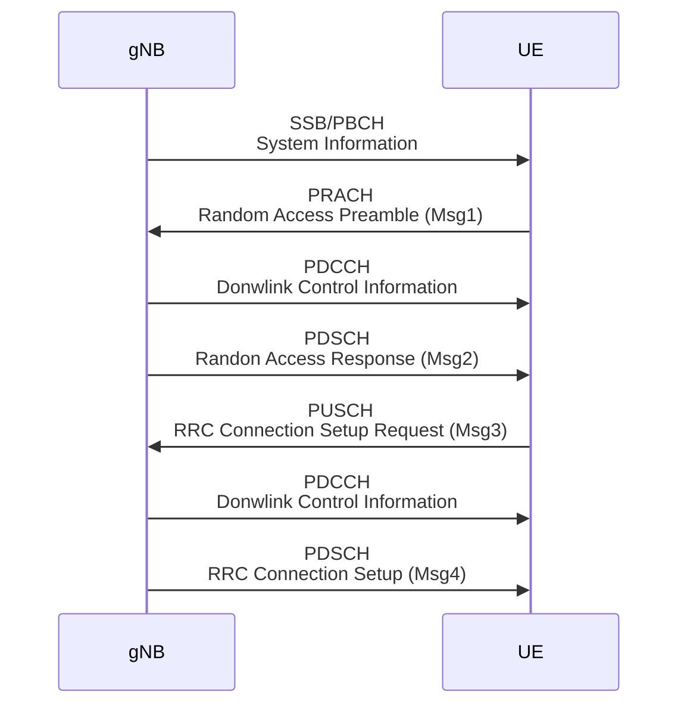

# 20250306 Thesis (Basic Collision Simulation)

###### tags: `2025`

**Goal:**
- [x] Write Basic Collision Simulation for Analysis of PRACH Attack on Network Energy Saving

**References:**
- Modeling Random Access with Capture and Power Control for IEEE 802.11be Systems
- [Modeling and Estimation of One-Shot Random Access for Finite-User Multichannel Slotted ALOHA Systems](https://ieeexplore.ieee.org/document/6211364)
- [20250227 Thesis (Basic Collision Model)](https://github.com/bmw-ece-ntust/prach-attack-analysis/blob/master/docs/20250227%20Thesis%20(Basic%20Collision%20Model).md)

**Table of Contents:**
- [20250306 Thesis (Basic Collision Simulation)](#20250306-thesis--basic-collision-simulation-)
          + [tags: `2025`](#tags---2025-)
  * [1. Define UE and PRACH parameters](#1-define-ue-and-prach-parameters)
    + [1.1. System Model](#11-system-model)
    + [1.2. 5G PRACH](#12-5g-prach)
    + [1.3. PRACH parameters](#13-prach-parameters)
  * [2. Simulation Implementation in Python Code](#2-simulation-implementation-in-python-code)
    + [2.1. Code based on original Paper](#21-code-based-on-original-paper)
      - [2.1.1. Parameters](#211-parameters)
      - [2.1.2. Code](#212-code)
      - [2.1.3. Result](#213-result)
    + [2.2. Modify Code to Imitate ZX's Result](#22-modify-code-to-imitate-zx-s-result)
      - [2.2.1. Parameters](#221-parameters)
      - [2.2.2. Code](#222-code)
      - [2.2.3. Result](#223-result)
  * [3. Add Msg1 and Channel Noise Energy](#3-add-msg1-and-channel-noise-energy)
    + [3.1. Msg1 and Channel Noise Energy Equation](#31-msg1-and-channel-noise-energy-equation)
    + [3.2. Modify Code to Add Msg1 and Channel Noise Energy](#32-modify-code-to-add-msg1-and-channel-noise-energy)
      - [3.2.1. Parameters](#321-parameters)
      - [3.2.2. Code](#322-code)
      - [3.2.3. Result](#323-result)

<small><i><a href='http://ecotrust-canada.github.io/markdown-toc/'>Table of contents generated with markdown-toc</a></i></small>


## 1. Define UE and PRACH parameters

### 1.1. System Model



### 1.2. 5G PRACH



### 1.3. PRACH parameters

| Category | Parameter                                                                                                 | Value                            |
| -------- | --------------------------------------------------------------------------------------------------------- | -------------------------------- |
| UE RA    | ra-ResponseWindow<hr>ra-ContentionResolutionTimer                                                         | 10ms<hr>64ms                     |
| gNB RO   | ssb-PositionsInBurst<hr>prach-ConfigurationIndex<hr>msg1-FDM<hr>ssb-perRACH-OccasionAndCB-PreamblesPerSSB | 1 SSB<hr>159<hr>1 RO<hr>OneAnd60 |

## 2. Simulation Implementation in Python Code

### 2.1. Code based on original Paper

#### 2.1.1. Parameters

| Parameter | Value |
| --------- | ----- |
| $M$       | 100   |
| $N$       | 5~45  |
| $I_{max}$ | 10    |


#### 2.1.2. Code

```python
import numpy as np
import matplotlib.pyplot as plt

def compute_PC_PS_TA(M=100, I_max=10, N_values=range(5, 46), num_simulations=int(1e4)):
    P_C_list = []
    P_S_list = []
    T_A_list = []
    
    for N in N_values:
        print("N = " + str(N) + "\n") 
        total_collisions = 0
        total_successes = 0
        total_attempts = 0
        total_T_A = 0
        
        for _ in range(num_simulations):
            K_i = M  # Initially, all UEs attempt Msg1
            N_C_total = 0
            N_S_total = 0
            N_total = 0
            weighted_sum_TA = 0
            
            for i in range(1, I_max + 1):
                preamble_choices = np.random.randint(0, N, K_i)  # Each UE picks a preamble randomly
                unique, counts = np.unique(preamble_choices, return_counts=True)
                successful_preambles = (counts == 1).sum()
                collided_preambles = (counts > 1).sum()
                
                N_S_i = successful_preambles
                N_C_i = collided_preambles
                
                N_S_total += N_S_i
                N_C_total += N_C_i
                N_total += N
                weighted_sum_TA += i * N_S_i  # Weighted sum for Ta calculation
                
                K_i -= N_S_i  # Remaining UEs after success
                if K_i <= 0:
                    break  # All UEs successfully sent Msg1
            
            total_collisions += N_C_total
            total_successes += N_S_total
            total_attempts += N_total
            if N_S_total > 0:
                total_T_A += weighted_sum_TA / N_S_total
        
        P_C = total_collisions / total_attempts  # Collision probability
        P_S = total_successes / (M * num_simulations)  # Access success probability
        T_A = total_T_A / num_simulations if total_successes > 0 else 0  # Average access delay
        
        P_C_list.append(P_C)
        P_S_list.append(P_S)
        T_A_list.append(T_A)
    
    return N_values, P_C_list, P_S_list, T_A_list

# Compute values
N_values, P_C_list, P_S_list, T_A_list = compute_PC_PS_TA()

# Plot PC graph
plt.figure(figsize=(18, 5))
plt.subplot(1, 3, 1)
plt.plot(N_values, P_C_list, marker='o', linestyle='-', color='r', label='P_C (Simulated)')
plt.xlabel('Number of Preambles (N)')
plt.ylabel('Collision Probability (P_C)')
plt.title('Collision Probability vs Number of Preambles')
plt.ylim(0, 1)
plt.grid(True)
plt.legend()

# Plot PS graph
plt.subplot(1, 3, 2)
plt.plot(N_values, P_S_list, marker='s', linestyle='-', color='b', label='P_S (Simulated)')
plt.xlabel('Number of Preambles (N)')
plt.ylabel('Access Success Probability (P_S)')
plt.title('Access Success Probability vs Number of Preambles')
plt.ylim(0, 1)
plt.grid(True)
plt.legend()

# Plot TA graph
plt.subplot(1, 3, 3)
plt.plot(N_values, T_A_list, marker='^', linestyle='-', color='g', label='T_A (Simulated)')
plt.xlabel('Number of Preambles (N)')
plt.ylabel('Average Access Delay (T_A)')
plt.title('Average Access Delay vs Number of Preambles')
plt.ylim(0, 10)
plt.grid(True)
plt.legend()

plt.tight_layout()
plt.show()

```

#### 2.1.3. Result


### 2.2. Modify Code to Imitate ZX's Result

#### 2.2.1. Parameters

| Parameter | Value                       | Reference                                            |
| --------- | --------------------------- | ---------------------------------------------------- |
| $M$       | 2                           | Experiment uses MTK and Samsung UE                   |
| $N$       | 60                          | ssb-perRACH-OccasionAndCB-PreamblesPerSSB = OneAnd60 |
| $I_{max}$ | 185 (MTK) and 155 (Samsung) | -                                                    |


#### 2.2.2. Code

```python=
import numpy as np
import matplotlib.pyplot as plt

def compute_PC_PS_TA(M=2, I_max=155, N=60, num_simulations=int(1e4)):
    P_C = 0
    P_S = 0
    T_A = 0
    N_S_i_list = []
    N_C_i_list = []
    K_i_list = []
    i_list = []
    
    total_collisions = 0
    total_successes = 0
    total_attempts = 0
    total_T_A = 0
    
    for i in range(1, I_max + 1):
        i_list.append(i)
        K_i_list.append(0)
        N_S_i_list.append(0)
        N_C_i_list.append(0)
    
    for i_simulations in range(num_simulations):
        print("i_simulations = " + str(i_simulations) + "\n") 
        K_i = M  # Initially, all UEs attempt Msg1
        N_C_total = 0
        N_S_total = 0
        N_total = 0
        weighted_sum_TA = 0
        
        for i in range(1, I_max + 1):
            K_i_list[i-1] = K_i_list[i-1] + K_i
            preamble_choices = np.random.randint(0, N, K_i)  # Each UE picks a preamble randomly
            unique, counts = np.unique(preamble_choices, return_counts=True)
            successful_preambles = (counts == 1).sum()
            collided_preambles = (counts > 1).sum()
            
            N_S_i = successful_preambles
            N_C_i = collided_preambles
            
            N_S_i_list[i-1] = N_S_i_list[i-1] + N_S_i
            N_C_i_list[i-1] = N_C_i_list[i-1] + N_C_i
            
            N_S_total += N_S_i
            N_C_total += N_C_i
            N_total += N
            weighted_sum_TA += i * N_S_i  # Weighted sum for Ta calculation
            
            K_i -= N_S_i  # Remaining UEs after success
            if K_i <= 0:
                break  # All UEs successfully sent Msg1
        
        total_collisions += N_C_total
        total_successes += N_S_total
        total_attempts += N_total
        if N_S_total > 0:
            total_T_A += weighted_sum_TA / N_S_total
    
    P_C = total_collisions / total_attempts  # Collision probability
    P_S = total_successes / (M * num_simulations)  # Access success probability
    T_A = total_T_A / num_simulations if total_successes > 0 else 0  # Average access delay
    
    K_i_list[:] = [x / num_simulations for x in K_i_list]
    N_S_i_list[:] = [x / num_simulations for x in N_S_i_list]
    N_C_i_list[:] = [x / num_simulations for x in N_C_i_list]
    
    return N, P_C, P_S, T_A, K_i_list, i_list, N_S_i_list, N_C_i_list

# Compute values
N, P_C, P_S, T_A, K_i_list, i_list, N_S_i_list, N_C_i_list = compute_PC_PS_TA()

print("P_C = " + str(P_C) + "\n")

# Plot Ki graph
plt.figure(figsize=(18, 5))
plt.subplot(1, 3, 1)
plt.plot(i_list, K_i_list, marker='o', linestyle='-', color='r', label='K_i')
plt.xlabel('Number of Slots (i)')
plt.ylabel('Remaining UEs (K_i)')
plt.title('Remaining UEs vs Number of Slots')
plt.ylim(0, 5)
plt.grid(True)
plt.legend()

# Plot NSi graph
plt.subplot(1, 3, 2)
plt.plot(i_list, N_S_i_list, marker='o', linestyle='-', color='b', label='N_S_i')
plt.xlabel('Number of Slots (i)')
plt.ylabel('Expected successful preambles (N_S_i)')
plt.title('Expected successful preambles vs Number of Slots')
plt.ylim(0, 5)
plt.grid(True)
plt.legend()

# Plot NCi graph
plt.subplot(1, 3, 3)
plt.plot(i_list, N_C_i_list, marker='o', linestyle='-', color='g', label='N_C_i')
plt.xlabel('Number of Slots (i)')
plt.ylabel('Collided preambles (N_C_i)')
plt.title('Collided preambles vs Number of Slots')
plt.ylim(0, 5)
plt.grid(True)
plt.legend()

plt.tight_layout()
plt.show()
```

#### 2.2.3. Result

$P_C$ = 0


## 3. Add Msg1 and Channel Noise Energy

### 3.1. Msg1 and Channel Noise Energy Equation

1. gNB will calculate current channel noise = 0.9 x last channel noise + 0.1 msg signal power
```math
P_{noise,i+1} = 0.9 * P_{noise,i} + P_{msg1,i}
```

2. $P_{msg1,i}$ for all UEs are constant 55dB if they havent got success
```math
P_{msg1,i} =
\begin{cases} 
50, & \text{if } P_{msg1,i} > P_{noise,i} \\ 
0, & \text{otherwise} 
\end{cases}
```

3. $N_i$ depends if $P_{msg1,i}$ > P_{noise,i}
```math
N_i =
\begin{cases} 
N, & \text{if } K_i > 0 \\ 
0, & \text{otherwise} 
\end{cases}
```

### 3.2. Modify Code to Add Msg1 and Channel Noise Energy

#### 3.2.1. Parameters

| Parameter | Value                       | Reference                                            |
| --------- | --------------------------- | ---------------------------------------------------- |
| $M$       | 2                           | Experiment uses MTK and Samsung UE                   |
| $N$       | 60                          | ssb-perRACH-OccasionAndCB-PreamblesPerSSB = OneAnd60 |
| $I_{max}$ | 185 (MTK) and 155 (Samsung) | -                                                    |
| $P_{noise,1}$ | 25 | -                                                    |


#### 3.2.2. Code

```python

```

#### 3.2.3. Result

$P_C$ = 0

