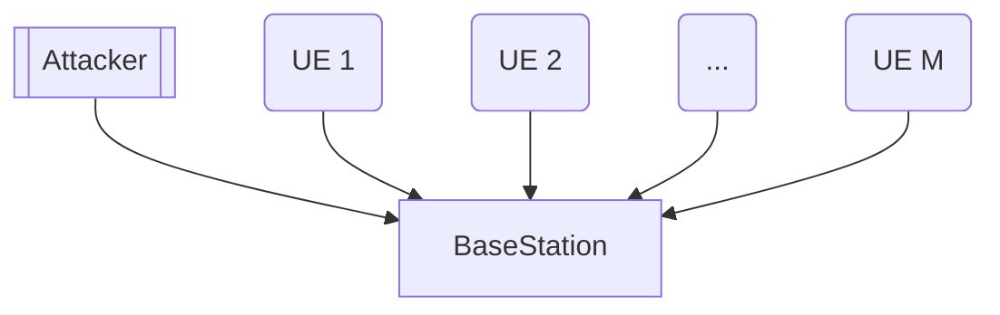
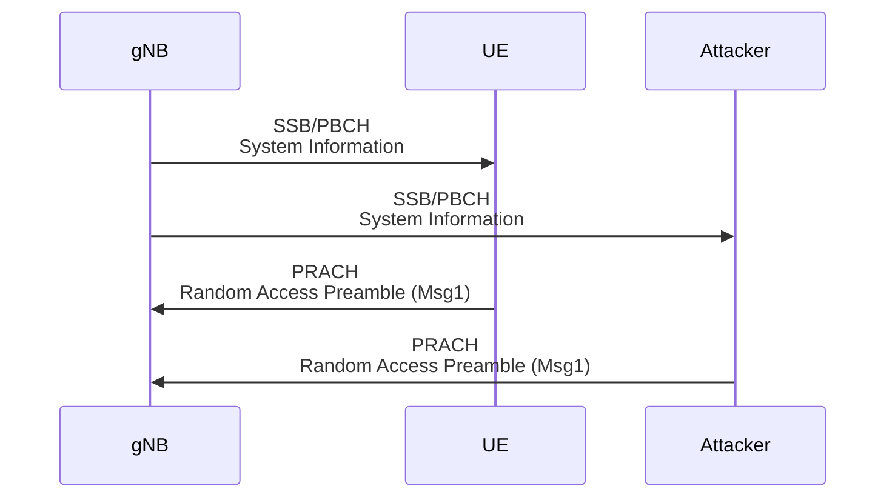

# 20250306 Thesis (Incorporate Attacker into Collision Simulation)

###### tags: `2025`

**Goal:**
- [x] Write Incorporate Attacker Collision Simulation for Analysis of PRACH Attack on Network Energy Saving

**References:**
- Modeling Random Access with Capture and Power Control for IEEE 802.11be Systems
- [Modeling and Estimation of One-Shot Random Access for Finite-User Multichannel Slotted ALOHA Systems](https://ieeexplore.ieee.org/document/6211364)
- [20250306 Thesis (Basic Collision Simulation)](https://github.com/bmw-ece-ntust/prach-attack-analysis/blob/master/docs/20250306%20Thesis%20(Basic%20Collision%20Simulation).md)
- [20250304 Thesis (Incorporate Attacker into Collision Model)](https://github.com/bmw-ece-ntust/prach-attack-analysis/blob/master/docs/20250304%20Thesis%20(Incorporate%20Attacker%20into%20Collision%20Model).md)

**Table of Contents:**
- [20250306 Thesis (Incorporate Attacker into Collision Simulation)](#20250306-thesis--incorporate-attacker-into-collision-simulation-)
          + [tags: `2025`](#tags---2025-)
  * [1. Add 1 Attacker for Msg1](#1-add-1-attacker-for-msg1)
    + [1.1. System Model](#11-system-model)
    + [1.2. 5G PRACH](#12-5g-prach)
    + [1.3. Notes and Assumptions](#13-notes-and-assumptions)
  * [2. Simulation Implementation in Python Code](#2-simulation-implementation-in-python-code)
    + [2.1. Parameters](#21-parameters)
    + [2.2. Code](#22-code)
    + [2.3.3. Result](#233-result)

<small><i><a href='http://ecotrust-canada.github.io/markdown-toc/'>Table of contents generated with markdown-toc</a></i></small>


## 1. Add 1 Attacker for Msg1

### 1.1. System Model



### 1.2. 5G PRACH



### 1.3. Notes and Assumptions

1. Attacker send preamble to every RO
2. Fixed preamble index sent by the attacker

## 2. Simulation Implementation in Python Code

### 2.1. Parameters

| Parameter | Value                       | Reference                                            |
| --------- | --------------------------- | ---------------------------------------------------- |
| $M$       | 2                           | Experiment uses MTK and Samsung UE                   |
| $N$       | 60                          | ssb-perRACH-OccasionAndCB-PreamblesPerSSB = OneAnd60 |
| $I_{max}$ | 185 (MTK) and 155 (Samsung) | -                                                    |
| $P_{noise,1}$ | 25 | -                                                    |

### 2.2. Code

```python
import numpy as np
import matplotlib.pyplot as plt

def compute_PC_PS_TA(M=2, I_max=155, N=60, num_simulations=int(1e4)):
    total_collisions = 0
    total_successes = 0
    total_attempts = 0
    total_T_A = 0
    
    i_list = np.arange(1, I_max + 1)
    K_i_list = np.zeros(I_max)
    N_S_i_list = np.zeros(I_max)
    N_C_i_list = np.zeros(I_max)
    
    for i_simulation in range(num_simulations):
        K_i = M  # Initially, all UEs attempt Msg1
        P_msg1_i = 50
        P_noise_i = 25
        
        N_C_total = 0
        N_S_total = 0
        N_total = 0
        weighted_sum_TA = 0
        
        for i in range(1, I_max + 1):
            if P_msg1_i > P_noise_i:
                N_i = N
            else:
                N_i = 0.000000001
            
            K_i_list[i-1] += K_i
            
            # Simulate random preamble selection including attacker
            preamble_choices = np.random.randint(0, N, K_i)
            attacker_preamble = np.random.randint(0, N)  # Attacker selects a preamble
            
            unique, counts = np.unique(np.append(preamble_choices, attacker_preamble), return_counts=True)
            successful_preambles = (counts == 1).sum() - (attacker_preamble in unique)  # Remove attacker's impact
            collided_preambles = (counts > 1).sum()
            
            N_S_i = max(successful_preambles, 0)
            N_C_i = collided_preambles
            
            N_S_i_list[i-1] += N_S_i
            N_C_i_list[i-1] += N_C_i
            
            N_S_total += N_S_i
            N_C_total += N_C_i
            N_total += N
            weighted_sum_TA += i * N_S_i  # Weighted sum for Ta calculation
            
            K_i -= N_S_i  # Remaining UEs after success
            
            if K_i <= 0:
                P_msg1_i = 0
            
            P_noise_i = 0.9 * P_noise_i + 0.1 * P_msg1_i
            
            if K_i <= 0:
                break  # All UEs successfully sent Msg1
        
        total_collisions += N_C_total
        total_successes += N_S_total
        total_attempts += N_total
        if N_S_total > 0:
            total_T_A += weighted_sum_TA / N_S_total
    
    P_C = total_collisions / total_attempts  # Collision probability
    P_S = total_successes / (M * num_simulations)  # Access success probability
    T_A = total_T_A / num_simulations if total_successes > 0 else 0  # Average access delay
    
    K_i_list /= num_simulations
    N_S_i_list /= num_simulations
    N_C_i_list /= num_simulations
    
    return N, P_C, P_S, T_A, K_i_list, i_list, N_S_i_list, N_C_i_list

# Compute values
N, P_C, P_S, T_A, K_i_list, i_list, N_S_i_list, N_C_i_list = compute_PC_PS_TA()

print(f"P_C = {P_C}\n")

# Plot graphs
plt.figure(figsize=(18, 5))
plt.subplot(1, 3, 1)
plt.plot(i_list, K_i_list, marker='o', linestyle='-', color='r', label='K_i')
plt.xlabel('Number of Slots (i)')
plt.ylabel('Remaining UEs (K_i)')
plt.title('Remaining UEs vs Number of Slots')
plt.ylim(0, 5)
plt.grid(True)
plt.legend()

plt.subplot(1, 3, 2)
plt.plot(i_list, N_S_i_list, marker='o', linestyle='-', color='b', label='N_S_i')
plt.xlabel('Number of Slots (i)')
plt.ylabel('Expected successful preambles (N_S_i)')
plt.title('Successful Preambles vs Number of Slots')
plt.ylim(0, 5)
plt.grid(True)
plt.legend()

plt.subplot(1, 3, 3)
plt.plot(i_list, N_C_i_list, marker='o', linestyle='-', color='g', label='N_C_i')
plt.xlabel('Number of Slots (i)')
plt.ylabel('Collided preambles (N_C_i)')
plt.title('Collided Preambles vs Number of Slots')
plt.ylim(0, 5)
plt.grid(True)
plt.legend()

plt.tight_layout()
plt.show()
```

### 2.3.3. Result

$P_C$ = 0

