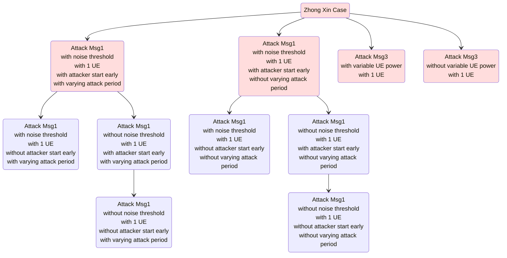
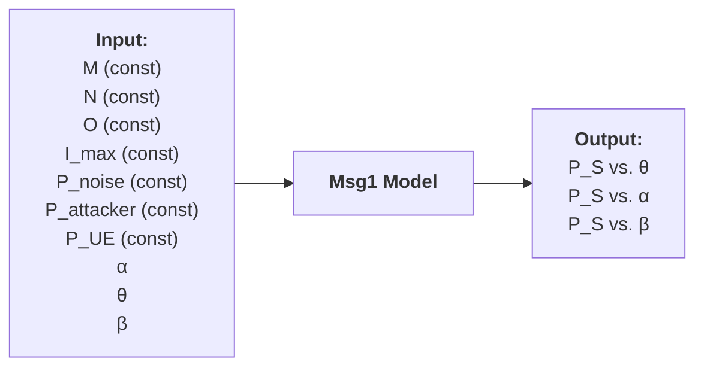
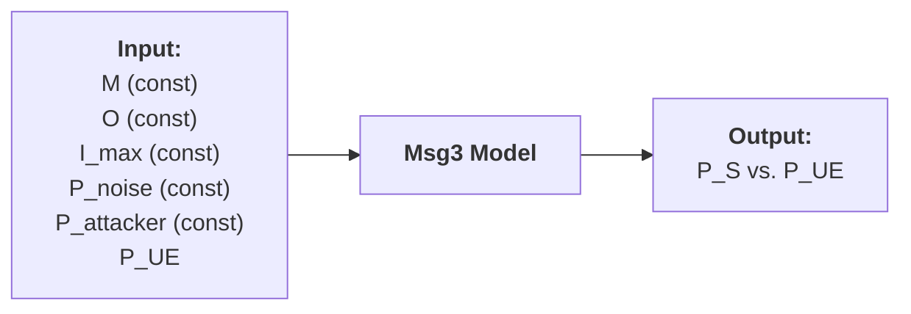

# 20250307 Thesis (PRACH Attack Problem Definition)

###### tags: `2025`

**Goal:**
- [x] Map the PRACH Attack Problem
- [x] Define the PRACH Attack Problem that I want to focus on
- [ ] Define the input and output of the problem

**References:**
- [5G/NR - Initial Access/RACH](https://www.sharetechnote.com/html/5G/5G_RACH.html)
- [Techniques and Impact Evaluation of RACH Jamming in 5G network](https://etheses.lib.ntust.edu.tw/thesis/detail/64057b454c8e6e7e11cfd2812c8fecf7/)
- [20250307 Thesis (Random Access Procedure and Attack)](https://github.com/bmw-ece-ntust/wilfrid-prach-attack-analysis/blob/master/docs/20250307%20Thesis%20(Random%20Access%20Procedure%20and%20Attack).md)

**Table of Contents:**
- [20250307 Thesis (PRACH Attack Problem Definition)](#20250307-thesis--prach-attack-problem-definition-)
          + [tags: `2025`](#tags---2025-)
  * [1. Map of PRACH Attack Problem](#1-map-of-prach-attack-problem)
  * [2. PRACH Attack Problem to focus on](#2-prach-attack-problem-to-focus-on)
  * [3. Input and Output of the PRACH Attack Problem](#3-input-and-output-of-the-prach-attack-problem)
    + [3.1. Attack Msg1](#31-attack-msg1)

<small><i><a href='http://ecotrust-canada.github.io/markdown-toc/'>Table of contents generated with markdown-toc</a></i></small>


## 1. Map of PRACH Attack Problem

**Legend:**
- Different Color = Available Data from ZhongXin's Thesis
- Line to Dot = Planned problem focus

```mermaid
stateDiagram-v2
    classDef zhongXinCase fill:#fdd

    s1: PRACH Attack
    s2: Attack Msg1
    s3: Attack Msg3
    s4: Attack Msg1 and Msg3 Together
    s1 --> s2
    s1 --> s3
    s1 --> s4
    s5: Attack Msg1<br>with noise threshold
    s6: Attack Msg1<br>without noise threshold
    s2 --> s5
    s2 --> s6
    s7: Attack Msg3<br>with noise threshold
    s8: Attack Msg3<br>without noise threshold
    s3 --> s7
    s3 --> s8
    s9: Attack Msg1<br>with noise threshold<br>with 1 UE
    s10: Attack Msg1<br>with noise threshold<br>with multi UE
    s11: Attack Msg1<br>without noise threshold<br>with 1 UE
    s12: Attack Msg1<br>without noise threshold<br>with multi UE
    s5 --> s9
    s5 --> s10
    s6 --> s11
    s6 --> s12
    s13: Attack Msg3<br>with variable UE power<br>with 1 UE
    s14: Attack Msg3<br>with variable UE power<br>with multi UE
    s15: Attack Msg3<br>without variable UE power<br>with 1 UE
    s16: Attack Msg3<br>without variable UE power<br>with multi UE
    s7 --> s13
    s7 --> s14
    s8 --> s15
    s8 --> s16
    s17: Attack Msg1<br>with noise threshold<br>with 1 UE<br>with attacker start early
    s18: Attack Msg1<br>with noise threshold<br>with 1 UE<br>without attacker start early
    s19: Attack Msg1<br>with noise threshold<br>with multi UE<br>with attacker start early
    s20: Attack Msg1<br>with noise threshold<br>with multi UE<br>without attacker start early
    s21: Attack Msg1<br>without noise threshold<br>with 1 UE<br>with attacker start early
    s22: Attack Msg1<br>without noise threshold<br>with 1 UE<br>without attacker start early
    s23: Attack Msg1<br>without noise threshold<br>with multi UE<br>with attacker start early
    s24: Attack Msg1<br>without noise threshold<br>with multi UE<br>without attacker start early
    s9 --> s17
    s9 --> s18
    s10 --> s19
    s10 --> s20
    s11 --> s21
    s11 --> s22
    s12 --> s23
    s12 --> s24
    s25: Attack Msg1<br>with noise threshold<br>with 1 UE<br>with attacker start early<br>with varying attack period
    s26: Attack Msg1<br>with noise threshold<br>with 1 UE<br>with attacker start early<br>without varying attack period
    s27: Attack Msg1<br>with noise threshold<br>with 1 UE<br>without attacker start early<br>with varying attack period
    s28: Attack Msg1<br>with noise threshold<br>with 1 UE<br>without attacker start early<br>without varying attack period
    s29: Attack Msg1<br>with noise threshold<br>with multi UE<br>with attacker start early<br>with varying attack period
    s30: Attack Msg1<br>with noise threshold<br>with multi UE<br>with attacker start early<br>without varying attack period
    s31: Attack Msg1<br>with noise threshold<br>with multi UE<br>without attacker start early<br>with varying attack period
    s32: Attack Msg1<br>with noise threshold<br>with multi UE<br>without attacker start early<br>without varying attack period
    s33: Attack Msg1<br>without noise threshold<br>with 1 UE<br>with attacker start early<br>with varying attack period
    s34: Attack Msg1<br>without noise threshold<br>with 1 UE<br>with attacker start early<br>without varying attack period
    s35: Attack Msg1<br>without noise threshold<br>with 1 UE<br>without attacker start early<br>with varying attack period
    s36: Attack Msg1<br>without noise threshold<br>with 1 UE<br>without attacker start early<br>without varying attack period
    s37: Attack Msg1<br>without noise threshold<br>with multi UE<br>with attacker start early<br>with varying attack period
    s38: Attack Msg1<br>without noise threshold<br>with multi UE<br>with attacker start early<br>without varying attack period
    s39: Attack Msg1<br>without noise threshold<br>with multi UE<br>without attacker start early<br>with varying attack period
    s40: Attack Msg1<br>without noise threshold<br>with multi UE<br>without attacker start early<br>without varying attack period
    s17 --> s25
    s17 --> s26
    s18 --> s27
    s18 --> s28
    s19 --> s29
    s19 --> s30
    s20 --> s31
    s20 --> s32
    s21 --> s33
    s21 --> s34
    s22 --> s35
    s22 --> s36
    s23 --> s37
    s23 --> s38
    s24 --> s39
    s24 --> s40

    s25 --> [*]
    s26 --> [*]
    s27 --> [*]
    s28 --> [*]
    s33 --> [*]
    s34 --> [*]
    s35 --> [*]
    s36 --> [*]
    s13 --> [*]
    s15 --> [*]

    class s25,s26,s13,s15 zhongXinCase
```




## 2. PRACH Attack Problem to focus on

**Available Data from ZhongXin's Thesis:**
- Attack Msg1 and Msg3 seperately:
    - Attack Msg1:
        - with noise threshold
        - with 1 UE
        - with attacker start early
            - with varying attack period (1)
            - without varying attack period (2)
    - Attack Msg3:
        - with 1 UE
            - with variable UE power (3)
            - without variable UE power (4)

**Planned problem focus:**


## 3. Input and Output of the PRACH Attack Problem

### 3.1. Attack Msg1

#### 3.1.1. Initial model

| Parameter      | Description                                                                                         | Value                                                                                             |
| -------------- | --------------------------------------------------------------------------------------------------- | ------------------------------------------------------------------------------------------------- |
| $M$            | Number of UE (Constant)                                                                             | 1 (Constant)                                                                                      |
| $N$            | Number of Preamble ID (Constant)                                                                    | 64 (Constant)                                                                                     |
| $O$            | Number of Attacked Random Access Occasion (Constant)                                                | 1 (Constant)                                                                                      |
| $I_{max}$      | Number of Total Slots of Msg1 observation (Constant)                                                     | $x$ (Constant)                                                                                    |
| $P_{noise}$    | Initial Noise dB Threshold (Constant)                                                               | $x$ (Constant)                                                                                    |
| $P_{attacker}$ | Attacker's Msg1 dB Power (Constant)                                                                 | $x$ (Constant)                                                                                    |
| $P_{UE}$       | UE's Msg1 dB Power (Constant)                                                                       | $x$ (Constant)                                                                                    |
| $\alpha$       | Noise threshold parameter                                                                           | 0 = without noise threshold<br> $x$ = with noise threshold                                        |
| $\theta$       | Number of slots of early start for attacker relative to UE                                          | 0 = without attacker start early<br> $x$ = with attacker start early                              |
| $\beta$        | Variability/Percentage of Attack Period. This parameter is directly related to ssb-perRACH-Occasion | 1 = without varying attacker period<br> $0.x$ = with varying attack periode (e.g. 0.5, 0.25, etc) |
| $P_S$          | UE's Msg1 Access Success Probability                                                                | This is output                                                                                    |


**Notes:**
1. Noise threshold:
```math
P_{noise,i+1} = (1 - \alpha) * P_{noise,i} + \alpha * P_{msg1 error,i}
```

#### 3.1.2. Possible Extension

| Parameter | Description                    | Value                                          |
| --------- | ------------------------------ | ---------------------------------------------- |
| $M$       | Number of UE                   | 1 = initial model<br>$x$ = extension           |
| $O$       | Number of Attacked Preamble ID | 1 = initial model<br>$x$ = extension (upto 64) |

### 3.2. Attack Msg1

#### 3.2.1. Initial model

| Parameter      | Description                                          | Value          |
| -------------- | ---------------------------------------------------- | -------------- |
| $M$            | Number of UE (Constant)                              | 1 (Constant)   |
| $O$            | Number of Attacked Msg3 (Constant)                   | 1 (Constant)   |
| $I_{max}$      | Number of Total Slots of Msg3 observation (Constant) | $x$ (Constant) |
| $P_{noise}$    | Initial Noise dB Threshold (Constant)                | $x$ (Constant) |
| $P_{attacker}$ | Attacker's Msg3 dB Power (Constant)                  | $x$ (Constant) |
| $P_{UE}$       | UE's Msg3 dB Power                                   | $x$            |
| $P_S$          | UE's Msg1 Access Success Probability                 | This is output |



#### 3.2.2. Possible Extension

| Parameter | Description                    | Value                                          |
| --------- | ------------------------------ | ---------------------------------------------- |
| $M$       | Number of UE                   | 1 = initial model<br>$x$ = extension           |
| $O$       | Number of Attacked Preamble ID | 1 = initial model<br>$x$ = extension (upto $M$) |

