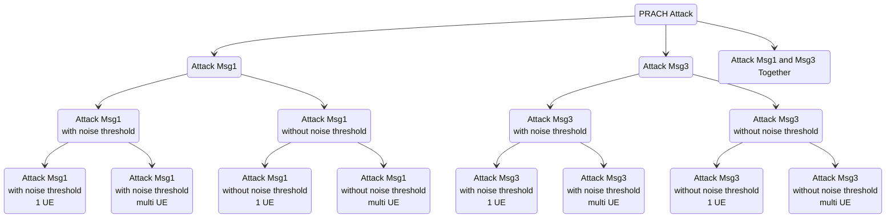

# 20250307 Thesis (PRACH Attack Problem Definition)

###### tags: `2025`

**Goal:**
- [x] Map the PRACH Attack Problem
- [x] Define the PRACH Attack Problem that I want to focus on

**References:**
- [5G/NR - Initial Access/RACH](https://www.sharetechnote.com/html/5G/5G_RACH.html)
- [Techniques and Impact Evaluation of RACH Jamming in 5G network](https://etheses.lib.ntust.edu.tw/thesis/detail/64057b454c8e6e7e11cfd2812c8fecf7/)
- [20250307 Thesis (Random Access Procedure and Attack)](https://github.com/bmw-ece-ntust/wilfrid-prach-attack-analysis/blob/master/docs/20250307%20Thesis%20(Random%20Access%20Procedure%20and%20Attack).md)

**Table of Contents:**

<small><i><a href='http://ecotrust-canada.github.io/markdown-toc/'>Table of contents generated with markdown-toc</a></i></small>

## 1. Map of PRACH Attack Problem

## 2. PRACH Attack Problem to focus on

