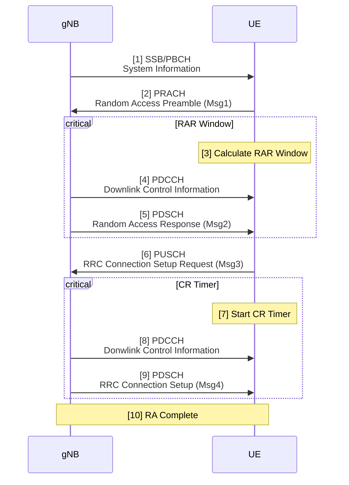
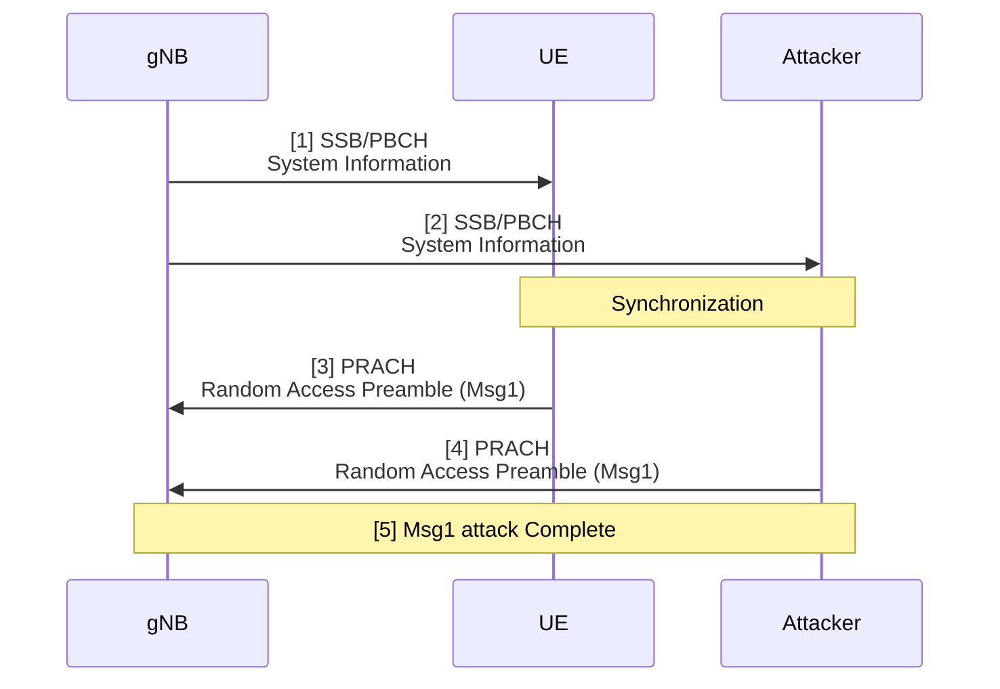
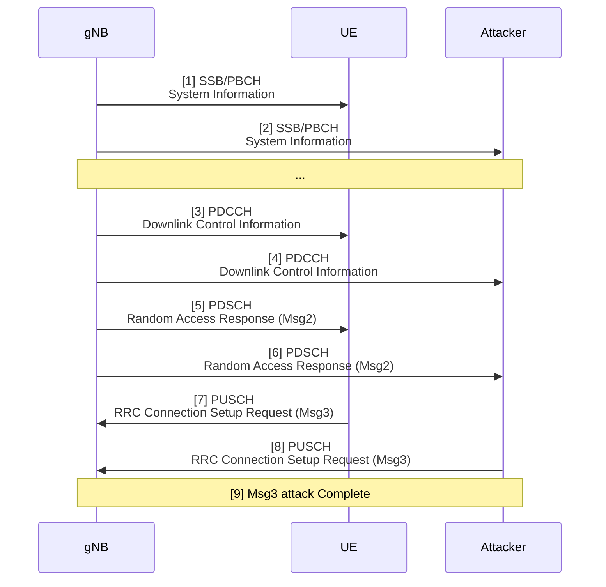

# 20250307 Thesis (Random Access Procedure and Attack)

###### tags: `2025`

**Goal:**
- [x] [Understand 5G Random Access Procedure](#1-random-access-procedure-step-by-step)
- [x] [Understand Random Access Procedure Attack](#2-random-access-procedure-attack-step-by-step)

**References:**
- [5G/NR - Initial Access/RACH](https://www.sharetechnote.com/html/5G/5G_RACH.html)
- [Techniques and Impact Evaluation of RACH Jamming in 5G network](https://etheses.lib.ntust.edu.tw/thesis/detail/64057b454c8e6e7e11cfd2812c8fecf7/)

**Table of Contents:**
- [20250307 Thesis (Random Access Procedure and Attack)](#20250307-thesis--random-access-procedure-and-attack-)
          + [tags: `2025`](#tags---2025-)
  * [1. Random Access Procedure Step by step](#1-random-access-procedure-step-by-step)
  * [2. Random Access Procedure Attack Step by step](#2-random-access-procedure-attack-step-by-step)
  * [2.1. RACH Msg 1 attack](#21-rach-msg-1-attack)
  * [2.2. RACH Msg 3 attack](#22-rach-msg-3-attack)

<small><i><a href='http://ecotrust-canada.github.io/markdown-toc/'>Table of contents generated with markdown-toc</a></i></small>

## 1. Random Access Procedure Step by step

1.  gNB transmits the synchronization signal and PBCH (SSB), enabling the UE to acquire the cell’s system information and synchronize with the downlink
transmission

2. UE determines the allocation of PRACH resources and transmits a preamble (Msg1) to the gNB

3. UE starts calculating the random access response (RAR, also called Msg2) window, which is defined by the ra-ResponseWindow parameter determined by the gNB

4. gNB indicates the downlink control information (DCI) on the PDCCH, specifying the location of the PDSCH where Msg2 will be transmitted

5. Msg2 will be transmitted by gNB

6. UE uses the information in Msg2, to transmit the RRC setup request (Msg3) on PUSCH

7. UE starts the contention resolution (CR) timer, defined by the ra-ContentionResolutionTimer parameter

8. When the gNB receives Msg3, it responds with DCI on PDCCH

9. gNB send RRC connection setup (Msg4) on the PDSCH

10.  If the UE receives Msg4 within the CR timer, it transitions to the RRC connected state and sends the RRC connection complete (Msg4 Ack), completing the RA process

## 2. Random Access Procedure Attack Step by step

**Note:** for Zhong Xin's thesis, Msg1 and Msg3 attack is done seperately

## 2.1. RACH Msg 1 attack

RACH Msg1 attack transmits a Msg1 in every RO to collide with other UEs on the PRACH, with an expected collision probability of one in sixty-four

1.  gNB transmits the synchronization signal and PBCH (SSB), enabling the UE to acquire the cell’s system information and synchronize with the downlink
transmission

2. Attacker also receive synchronization signal and PBCH (SSB)

3. UE determines the allocation of PRACH resources and transmits a preamble (Msg1) to the gNB

4. Attacker also transmits a preamble (Msg1) to the gNB

## 2.2. RACH Msg 3 attack

RACH Msg3 attack decodes Msg2 to determine UL grants corresponding to RAPIDs, then transmits scrambled Msg3 to cause collisions or interference, with an expected collision probability of 100 percent.

1.  gNB transmits the synchronization signal and PBCH (SSB), enabling the UE to acquire the cell’s system information and synchronize with the downlink
transmission

2. Attacker also receive synchronization signal and PBCH (SSB)

3. gNB indicates the downlink control information (DCI) on the PDCCH, specifying the location of the PDSCH where Msg2 will be transmitted

4. Attacker also receive the downlink control information (DCI) on the PDCCH

5. Msg2 will be transmitted by gNB

6. Attacker also receive Msg2

7. UE uses the information in Msg2, to transmit the RRC setup request (Msg3) on PUSCH

8. Attacker uses the same information in Msg2, to transmit the scrambled Msg3 on PUSCH
