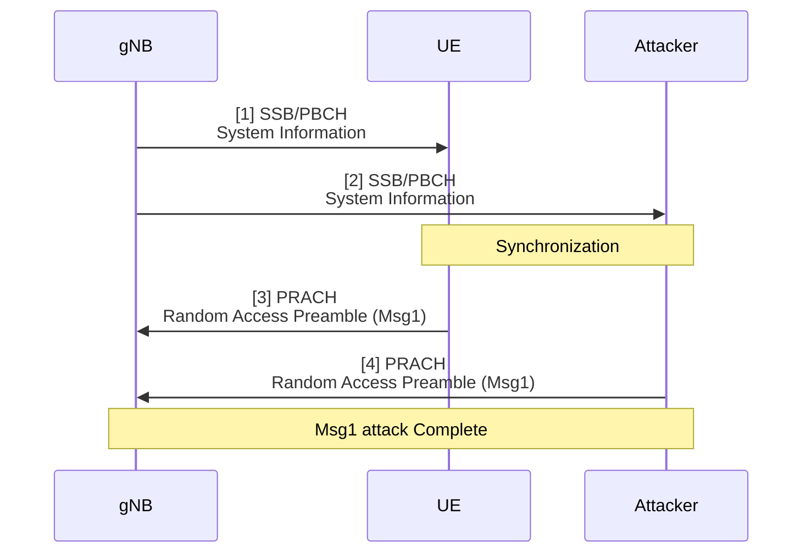
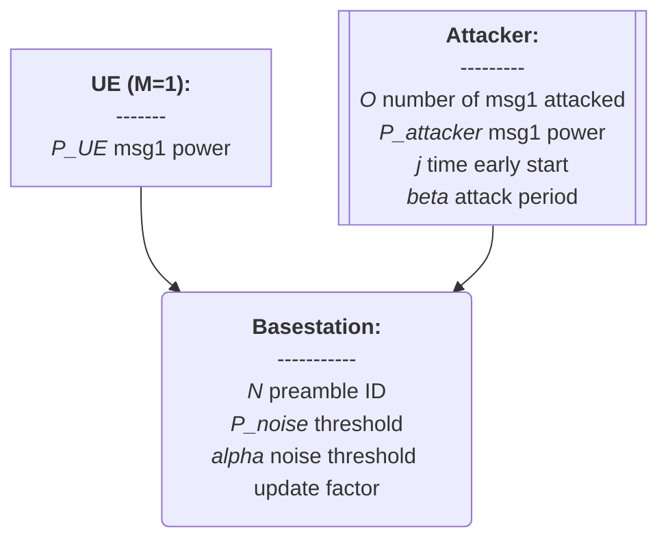
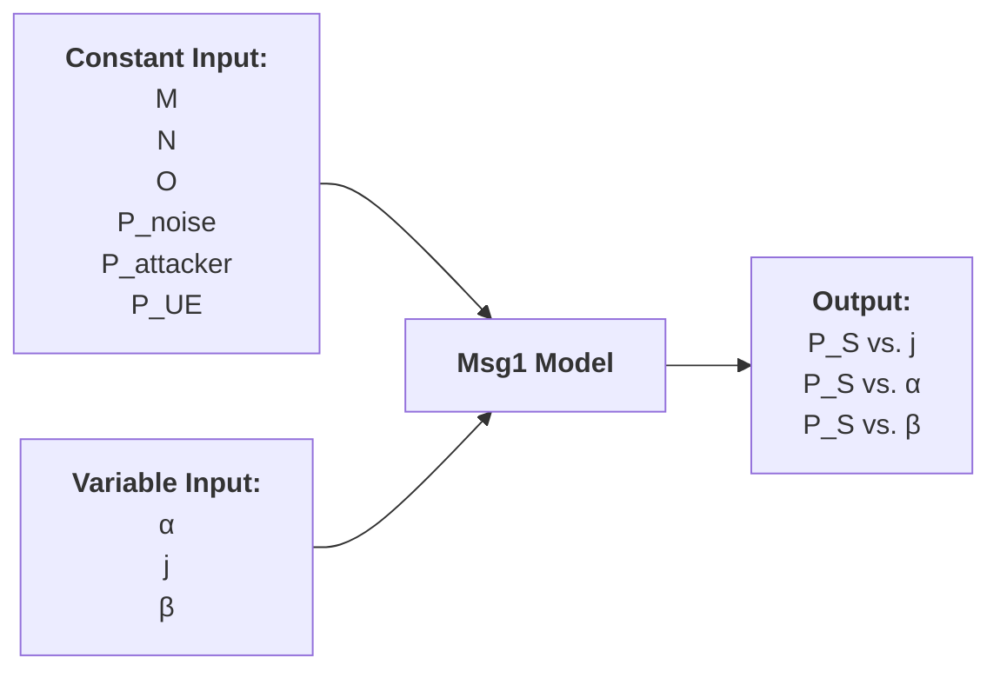

# 20250310 Thesis (Basic Msg1 Model)

###### tags: `2025`

**Goal:**
- [x] Write Basic Msg1 Model for Analysis of PRACH Attack on Network Energy Saving

**References:**
- Modeling Random Access with Capture and Power Control for IEEE 802.11be Systems
- [Modeling and Estimation of One-Shot Random Access for Finite-User Multichannel Slotted ALOHA Systems](https://ieeexplore.ieee.org/document/6211364)
- [20250307 Thesis (PRACH Attack Problem Definition)](https://github.com/bmw-ece-ntust/wilfrid-prach-attack-analysis/blob/master/docs/20250307%20Thesis%20(PRACH%20Attack%20Problem%20Definition).md)
- [Wireless Communications: Principles and Practice](https://www.amazon.com/Wireless-Communications-Principles-Practice-2nd/dp/0130422320)

**Table of Contents:**
<small><i><a href='http://ecotrust-canada.github.io/markdown-toc/'>Table of contents generated with markdown-toc</a></i></small>

## 1. System Model

### 1.2. PRACH Msg1 Attack Overview


### 1.2. Actors



### 1.3. Timing Diagram

```mermaid
---
displayMode: compact
---
gantt
    dateFormat mm
    title beta = 1
    axisFormat %M
    section gNB
    RAO 1 : done, rao1, 00, 5m
    RAO 2 : done, rao2, 10, 5m
    RAO 3 : done, rao3, 20, 5m
    RAO 4 : done, rao4, 30, 5m
    RAO 5 : done, rao5, 40, 5m
    RAO 6 : done, rao5, 50, 5m
    section Attacker
    ‎Msg1 : crit, att1, 00, 5m
    ‎Msg1 : crit, att2, 10, 5m
    ‎Msg1 : crit, att3, 20, 5m
    ‎Msg1 : crit, att4, 30, 5m
    ‎Msg1 : crit, att5, 40, 5m
    ‎Msg1 : crit, att5, 50, 5m
    ‎j : active, j1, 00, 30m
    section UE
    ‎Msg1 : ue1, 30, 5m
    ‎Msg1 : ue2, 40, 5m
    ‎Msg1 : ue3, 50, 5m
```

```mermaid
---
displayMode: compact
---
gantt
    dateFormat mm
    title beta = 0.5
    axisFormat %M
    section gNB
    RAO 1 : done, rao1, 00, 5m
    RAO 2 : done, rao2, 10, 5m
    RAO 3 : done, rao3, 20, 5m
    RAO 4 : done, rao4, 30, 5m
    RAO 5 : done, rao5, 40, 5m
    RAO 6 : done, rao5, 50, 5m
    section Attacker
    ‎Msg1 : crit, att1, 00, 5m
    ‎Msg1 : crit, att3, 20, 5m
    ‎Msg1 : crit, att5, 40, 5m
    ‎j : active, j1, 00, 30m
    section UE
    ‎Msg1 : ue1, 30, 5m
    ‎Msg1 : ue2, 40, 5m
    ‎Msg1 : ue3, 50, 5m
```

```mermaid
---
displayMode: compact
---
gantt
    dateFormat mm
    title beta = 0.25
    axisFormat %M
    section gNB RAO
    RAO 1 : done, rao1, 00, 5m
    RAO 2 : done, rao2, 10, 5m
    RAO 3 : done, rao3, 20, 5m
    RAO 4 : done, rao4, 30, 5m
    RAO 5 : done, rao5, 40, 5m
    RAO 6 : done, rao5, 50, 5m
    section Attacker
    Msg1 : crit, att1, 00, 5m
    ‎Msg1 : crit, att5, 40, 5m
    ‎j : active, j1, 00, 30m
    section UE Msg1
    ‎Msg1 : ue1, 30, 5m
    ‎Msg1 : ue2, 40, 5m
    ‎Msg1 : ue3, 50, 5m
```







## 2. Basic Model

### 2.1. Model Parameters

#### 2.1.1. Assumptions or Constant Input Parameter

| Parameter      | Description                    | Constant Value |
| -------------- | ------------------------------ | -------------- |
| $M$            | Number of UE                   | 1              |
| $N$            | Number of Preamble ID          | 64             |
| $O$            | Number of Attacked Preamble ID | 1              |
| $P_{noise}$    | Initial Noise dB Threshold     | $x$            |
| $P_{attacker}$ | Attacker's Msg1 dB Power       | $x$            |
| $P_{UE}$       | UE's Msg1 dB Power             | $x$            |

#### 2.1.2. Variable Input Parameter

| Parameter | Description                                                                                         | Value Range    |
| --------- | --------------------------------------------------------------------------------------------------- | -------------- |
| $i$       | identifier for the ith Random Access Occasion                                                       | 0..∞ (integer) |
| $\alpha$  | Noise update factor parameter                                                                       | 0..1 (real)    |
| $j$       | Number of Random Access Occasion early start for attacker relative to UE                            | 0..∞ (integer) |
| $\beta$   | Variability/Percentage of Attack Period. This parameter is directly related to ssb-perRACH-Occasion | 0..1 (real)    |

#### 2.1.3. Output Parameter or Performance Metrics

| Parameter | Description                          | Value Range |
| --------- | ------------------------------------ | ----------- |
| $P_S$     | UE's Msg1 Access Success Probability | 0 or 1      |



### 2.2. Model Equation

1. Noise threshold for $RAO = 1$:
```math
P_{noise,1} = P_{noise}
```
2. Noise threshold for $RAO = i$:
```math
P_{noise,i+1} =
\begin{cases} 
(1 - \alpha) * P_{noise,i} + \alpha * P_{attacker}, & \text{if } i > 1 \text{ and } (i-2) \bmod \frac{1}{\beta} = 0 \\ 
(1 - \alpha) * P_{noise,i} + \alpha * P_{noise}, & \text{otherwise} 
\end{cases}
```
3. Noise threshold for when attacker start early for $j$ RAO is equal to evaluating $P_{noise,i+1}$ over the range $i \in [1, j+1]$ and taking the $P_{noise,j+1}$
4. UE's Msg1 Success with Noise threshold at the $j+1$ RAO is:
```math
P_{S} =
\begin{cases} 
1, & \text{if } P_{UE} > P_{noise,j+1} \\ 
0, & \text{otherwise} 
\end{cases}
```

### 2.3. Model Implementation in Python Code

#### 2.3.1. Parameters

| Parameter      | Description                    | Value |
| -------------- | ------------------------------ | -------------- |
| $P_{noise}$    | Initial Noise dB Threshold     | 28            |
| $P_{attacker}$ | Attacker's Msg1 dB Power       | 55            |
| $P_{UE}$       | UE's Msg1 dB Power             | 54            |
| $\alpha$  | Noise update factor parameter                                                                       | 0.1    |
| $j$       | Number of Random Access Occasion early start for attacker relative to UE                            | 0..110 |
| $\beta$   | Variability/Percentage of Attack Period. This parameter is directly related to ssb-perRACH-Occasion | 1,0.5,0.25,0.125    |


#### 2.3.2. Code

```python
import numpy as np
import matplotlib.pyplot as plt

def compute_p_success(P_noise, P_attacker, P_UE, alpha, beta_values, j_max):
    j_range = np.arange(1, j_max + 1)
    results_P_S = {}
    results_P_noise_j1 = {}
    
    for beta in beta_values:
        P_noise_values = [P_noise]
        
        for i in range(1, j_max + 1):
            if (i - 2) % (1 / beta) == 0 and i > 1:
                P_next = (1 - alpha) * P_noise_values[-1] + alpha * P_attacker
            else:
                P_next = (1 - alpha) * P_noise_values[-1] + alpha * P_noise
            
            P_noise_values.append(P_next)
        
        P_S = [1 if P_UE > P_noise_values[j] else 0 for j in range(j_max)]
        results_P_S[beta] = P_S

        P_noise_j1 = [P_noise_values[j] for j in range(j_max)]
        results_P_noise_j1[beta] = P_noise_j1
    
    return j_range, results_P_S, results_P_noise_j1

# Given parameters
P_noise = 28  # dB
P_attacker = 55  # dB
P_UE = 54  # dB
alpha = 0.1
beta_values = [1, 0.5, 0.25, 0.125]
j_max = 110

# Compute results
j_range, results_P_S, results_P_noise_j1 = compute_p_success(P_noise, P_attacker, P_UE, alpha, beta_values, j_max)

# Plot results
plt.figure(figsize=(12, 6))
plt.subplot(1, 2, 1)
for beta, P_S in results_P_S.items():
    plt.plot(j_range, P_S, label=f'β = {beta}')

plt.xlabel("j (RAO Early Start)")
plt.ylabel("P_S (Msg1 Success Probability)")
plt.title("UE Msg1 Success Probability vs j for Different β Values")
plt.legend()
plt.grid()

plt.subplot(1, 2, 2)
for beta, P_noise_j1 in results_P_noise_j1.items():
    plt.plot(j_range, P_noise_j1, label=f'β = {beta}')

plt.xlabel("j (RAO Early Start)")
plt.ylabel("P_noise_j1 (gNB's Noise Threshold at j+1)")
plt.title("gNB's Noise Threshold at j+1 vs j for Different β Values")
plt.legend()
plt.grid()

plt.tight_layout()
plt.show()
```

#### 2.3.3. Result


## 3. Add UE and Attacker distance

**Notes:**
1. Parameters and Equation are referenced from [Wireless Communications: Principles and Practice](https://www.amazon.com/Wireless-Communications-Principles-Practice-2nd/dp/0130422320)

### 3.1. Model Parameters

#### 3.1.1. Assumptions or Constant Input Parameter

| Parameter      | Description                    | Constant Value |
| -------------- | ------------------------------ | -------------- |
| $G_{UE}$       | antenna gain of UE             | $x$            |
| $G_{attacker}$ | antenna gain of attacker       | $x$            |
| $\lambda$      | wavelength of the signal       | $x$            |
| $\gamma$       | path loss exponent             | $x$            |

#### 3.1.2. Variable Input Parameter

| Parameter | Description                                                                                         | Value Range    |
| --------- | --------------------------------------------------------------------------------------------------- | -------------- |
| $d_{UE}$       | distance between gNB to UE                                                       | 0..∞ (real) |
| $d_{attacker}$  | distance between gNB to attacker                                                                       | 0..∞ (real)    |
| $P_{UE,TX}$       | UE's Msg1 dB Power (tx by UE)                            | 0..∞ (real) |
| $P_{attacker,TX}$   | Attacker's Msg1 dB Power (rx by gNB) | 0..∞ (real)    |

#### 3.1.3. Output Parameter or Performance Metrics

| Parameter | Description                          | Value Range |
| --------- | ------------------------------------ | ----------- |
| $P_{attacker}$     | Attacker's Msg1 dB Power (rx by gNB) | 0..∞ (real)      |
| $P_{UE}$     | UE's Msg1 dB Power (rx by gNB) | 0..∞ (real)      |

### 3.2. Equation

0. All equations from [2.2](#22-equation) are still used

1. gNB will calculate current channel noise = 0.9 x last channel noise + 0.1 msg signal power
```math
P_{noise,i+1} = 0.9 * P_{noise,i} + P_{msg1,i}
```


### 3.3. Modify Code to Add Msg1 and Channel Noise Energy

#### 3.3.1. Parameters

| Parameter | Value                       | Reference                                            |
| --------- | --------------------------- | ---------------------------------------------------- |
| $M$       | 2                           | Experiment uses MTK and Samsung UE                   |
| $N$       | 60                          | ssb-perRACH-OccasionAndCB-PreamblesPerSSB = OneAnd60 |
| $I_{max}$ | 185 (MTK) and 155 (Samsung) | -                                                    |
| $P_{noise,1}$ | 25 | -                                                    |


#### 3.3.2. Code

```python

```

#### 3.3.3. Result

$P_C$ = 0
