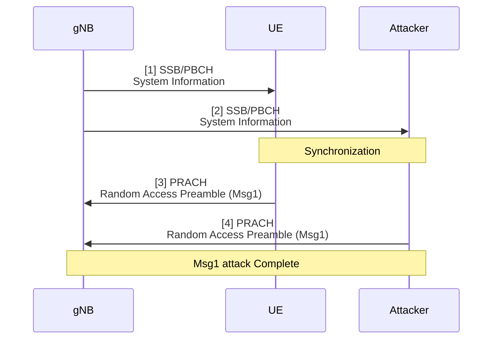
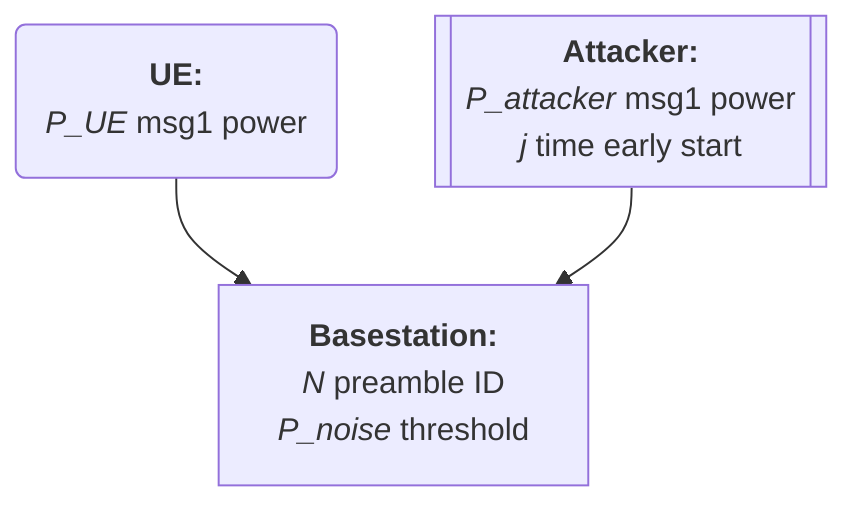

# 20250310 Thesis (Basic Msg1 Model)

###### tags: `2025`

**Goal:**
- [x] Write Basic Msg1 Model for Analysis of PRACH Attack on Network Energy Saving

**References:**
- Modeling Random Access with Capture and Power Control for IEEE 802.11be Systems
- [Modeling and Estimation of One-Shot Random Access for Finite-User Multichannel Slotted ALOHA Systems](https://ieeexplore.ieee.org/document/6211364)
- [20250307 Thesis (PRACH Attack Problem Definition)](https://github.com/bmw-ece-ntust/wilfrid-prach-attack-analysis/blob/master/docs/20250307%20Thesis%20(PRACH%20Attack%20Problem%20Definition).md)

**Table of Contents:**
<small><i><a href='http://ecotrust-canada.github.io/markdown-toc/'>Table of contents generated with markdown-toc</a></i></small>

## 1. System Model

### 1.2. PRACH Msg1 Attack Overview


### 1.2. Actors



### 1.3. PRACH parameters

| Category | Parameter                                                                                                 | Value                            |
| -------- | --------------------------------------------------------------------------------------------------------- | -------------------------------- |
| UE RA    | ra-ResponseWindow<hr>ra-ContentionResolutionTimer                                                         | 10ms<hr>64ms                     |
| gNB RO   | ssb-PositionsInBurst<hr>prach-ConfigurationIndex<hr>msg1-FDM<hr>ssb-perRACH-OccasionAndCB-PreamblesPerSSB | 1 SSB<hr>159<hr>1 RO<hr>OneAnd60 |

## 2. Model Collision Probability in PRACH by Approximation

### 2.1. Model Parameters

| Parameter | Description                                                                                                     |
| --------- | --------------------------------------------------------------------------------------------------------------- |
| $M$       | number of UEs sending Msg1                                                                                      |
| $N_i$     | number of Preambles per SSB for the $i^{th}$ SSB                                                                |

### 2.2. Equation

1. Expected value of the number of preambles that have only 1 UE's Msg1 for the first SSB
```math
N_{S,1} = M e^{-M/N_1}
```


## 3. Model Implementation in Python Code

### 3.1. Code based on original Paper

#### 3.1.1. Parameters

| Parameter | Value |
| --------- | ----- |
| $M$       | 100   |
| $N$       | 5~45  |
| $I_{max}$ | 10    |


#### 3.1.2. Code

```python

```

#### 3.1.3. Result


### 3.2. Modify Code to Imitate ZX's Result

#### 3.2.1. Parameters

| Parameter | Value                       | Reference                                            |
| --------- | --------------------------- | ---------------------------------------------------- |
| $M$       | 2                           | Experiment uses MTK and Samsung UE                   |
| $N$       | 60                          | ssb-perRACH-OccasionAndCB-PreamblesPerSSB = OneAnd60 |
| $I_{max}$ | 185 (MTK) and 155 (Samsung) | -                                                    |


#### 3.2.2. Code

```python=

```

#### 3.2.3. Result

$P_C$ = 0


## 4. Add Msg1 and Channel Noise Energy

### 4.1. Model Parameters

| Parameter | Description                                                                                                     |
| --------- | --------------------------------------------------------------------------------------------------------------- |
| $M$       | number of UEs sending Msg1                                                                                      |
| $N$     | total number of Preambles per SSB                                                                |

### 4.2. Equation

0. All equations from [2.2](#22-equation) are still used

1. gNB will calculate current channel noise = 0.9 x last channel noise + 0.1 msg signal power
```math
P_{noise,i+1} = 0.9 * P_{noise,i} + P_{msg1,i}
```


### 4.3. Modify Code to Add Msg1 and Channel Noise Energy

#### 4.3.1. Parameters

| Parameter | Value                       | Reference                                            |
| --------- | --------------------------- | ---------------------------------------------------- |
| $M$       | 2                           | Experiment uses MTK and Samsung UE                   |
| $N$       | 60                          | ssb-perRACH-OccasionAndCB-PreamblesPerSSB = OneAnd60 |
| $I_{max}$ | 185 (MTK) and 155 (Samsung) | -                                                    |
| $P_{noise,1}$ | 25 | -                                                    |


#### 4.3.2. Code

```python

```

#### 4.3.3. Result

$P_C$ = 0
