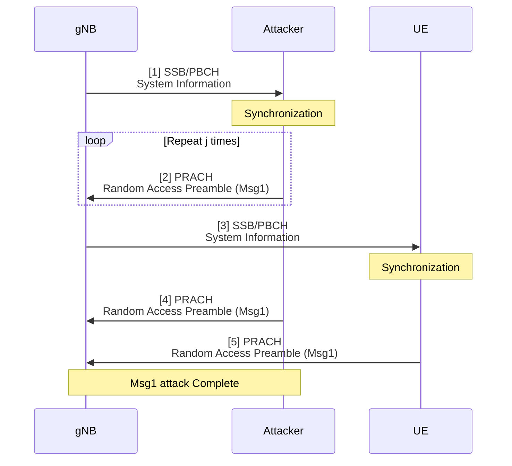
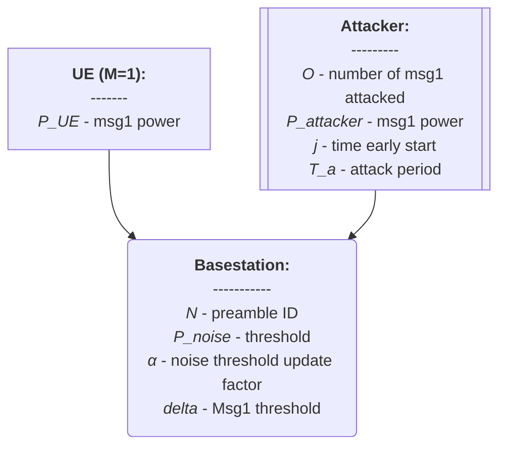
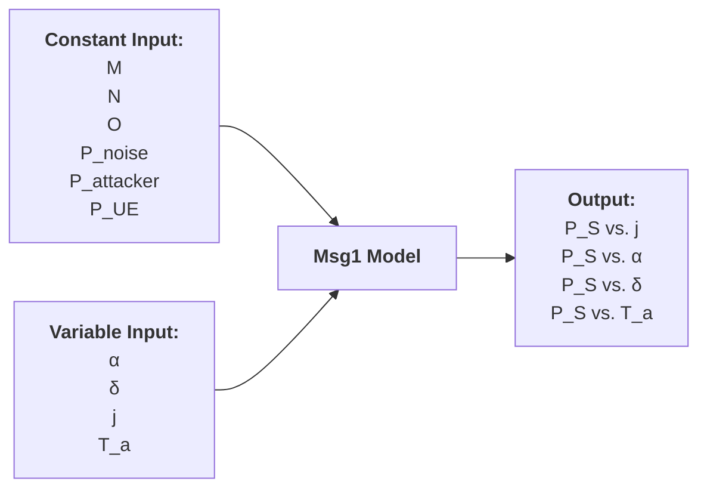
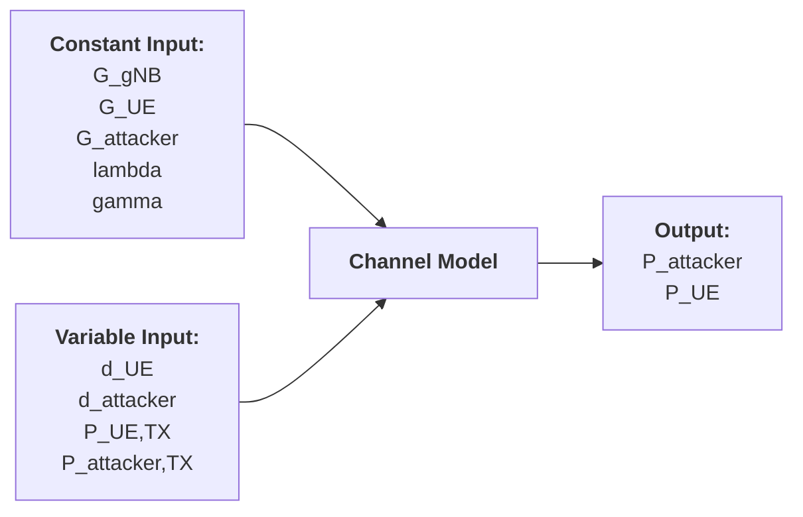

# 20250310 Thesis (Basic Msg1 Model)

###### tags: `2025`

**Goal:**
- [x] Write Basic Msg1 Model for Analysis of PRACH Attack on Network Energy Saving

**References:**
- Modeling Random Access with Capture and Power Control for IEEE 802.11be Systems
- [Modeling and Estimation of One-Shot Random Access for Finite-User Multichannel Slotted ALOHA Systems](https://ieeexplore.ieee.org/document/6211364)
- [20250307 Thesis (PRACH Attack Problem Definition)](https://github.com/bmw-ece-ntust/wilfrid-prach-attack-analysis/blob/master/docs/20250307%20Thesis%20(PRACH%20Attack%20Problem%20Definition).md)
- [Wireless Communications: Principles and Practice](https://www.amazon.com/Wireless-Communications-Principles-Practice-2nd/dp/0130422320)

**Table of Contents:**
- [20250310 Thesis (Basic Msg1 Model)](#20250310-thesis--basic-msg1-model-)
          + [tags: `2025`](#tags---2025-)
  * [1. System Model](#1-system-model)
    + [1.2. PRACH Msg1 Attack Overview](#12-prach-msg1-attack-overview)
    + [1.2. Actors](#12-actors)
    + [1.3. Timing Diagram](#13-timing-diagram)
  * [2. Basic Model](#2-basic-model)
    + [2.1. Model Parameters](#21-model-parameters)
      - [2.1.1. Assumptions or Constant Input Parameter](#211-assumptions-or-constant-input-parameter)
      - [2.1.2. Variable Input Parameter](#212-variable-input-parameter)
      - [2.1.3. Output Parameter or Performance Metrics](#213-output-parameter-or-performance-metrics)
    + [2.2. Model Equation](#22-model-equation)
    + [2.3. Model Implementation in Python Code](#23-model-implementation-in-python-code)
      - [2.3.1. Parameters](#231-parameters)
      - [2.3.2. Code](#232-code)
      - [2.3.3. Result](#233-result)
  * [3. Add UE and Attacker Channel Model](#3-add-ue-and-attacker-channel-model)
    + [3.1. Model Parameters](#31-model-parameters)
      - [3.1.1. Assumptions or Constant Input Parameter](#311-assumptions-or-constant-input-parameter)
      - [3.1.2. Variable Input Parameter](#312-variable-input-parameter)
      - [3.1.3. Output Parameter or Performance Metrics](#313-output-parameter-or-performance-metrics)
    + [3.2. Equation](#32-equation)
    + [3.3. Modify Code to Add UE and Attacker Channel Model](#33-modify-code-to-add-ue-and-attacker-channel-model)
      - [3.3.1. Parameters](#331-parameters)
      - [3.3.2. Code](#332-code)
      - [3.3.3. Result](#333-result)

<small><i><a href='http://ecotrust-canada.github.io/markdown-toc/'>Table of contents generated with markdown-toc</a></i></small>

## 1. System Model

### 1.2. PRACH Msg1 Attack Overview


### 1.2. Actors



### 1.3. Timing Diagram

```mermaid
---
displayMode: compact
---
gantt
    dateFormat mm
    title T_a = 1
    axisFormat %M
    section gNB
    RAO 1 : active, rao1, 00, 5m
    RAO 2 : active, rao2, 10, 5m
    RAO 3 : active, rao3, 20, 5m
    RAO 4 : active, rao4, 30, 5m
    RAO 5 : active, rao5, 40, 5m
    RAO 6 : active, rao5, 50, 5m
    section Attacker
    ‎Msg1 : crit, att1, 00, 5m
    ‎Msg1 : crit, att2, 10, 5m
    ‎Msg1 : crit, att3, 20, 5m
    ‎Msg1 : crit, att4, 30, 5m
    ‎Msg1 : crit, att5, 40, 5m
    ‎Msg1 : crit, att5, 50, 5m
    T_a : done, ta1, 00, 10m
    ‎j : done, j1, 00, 30m
    section UE
    ‎Msg1 : ue1, 30, 5m
    ‎Msg1 : ue2, 40, 5m
    ‎Msg1 : ue3, 50, 5m
```

```mermaid
---
displayMode: compact
---
gantt
    dateFormat mm
    title T_a = 2
    axisFormat %M
    section gNB
    RAO 1 : active, rao1, 00, 5m
    RAO 2 : active, rao2, 10, 5m
    RAO 3 : active, rao3, 20, 5m
    RAO 4 : active, rao4, 30, 5m
    RAO 5 : active, rao5, 40, 5m
    RAO 6 : active, rao5, 50, 5m
    section Attacker
    ‎Msg1 : crit, att1, 00, 5m
    ‎Msg1 : crit, att3, 20, 5m
    ‎Msg1 : crit, att5, 40, 5m
    T_a : done, ta1, 00, 20m
    ‎j : done, j1, 00, 30m
    section UE
    ‎Msg1 : ue1, 30, 5m
    ‎Msg1 : ue2, 40, 5m
    ‎Msg1 : ue3, 50, 5m
```

```mermaid
---
displayMode: compact
---
gantt
    dateFormat mm
    title T_a = 4
    axisFormat %M
    section gNB
    RAO 1 : active, rao1, 00, 5m
    RAO 2 : active, rao2, 10, 5m
    RAO 3 : active, rao3, 20, 5m
    RAO 4 : active, rao4, 30, 5m
    RAO 5 : active, rao5, 40, 5m
    RAO 6 : active, rao5, 50, 5m
    section Attacker
    Msg1 : crit, att1, 00, 5m
    ‎Msg1 : crit, att5, 40, 5m
    T_a : done, ta1, 00, 40m
    ‎j : done, j1, 00, 30m
    section UE Msg1
    ‎Msg1 : ue1, 30, 5m
    ‎Msg1 : ue2, 40, 5m
    ‎Msg1 : ue3, 50, 5m
```







## 2. Basic Model

### 2.1. Model Parameters

#### 2.1.1. Assumptions or Constant Input Parameter

| Parameter      | Description                    | Constant Value |
| -------------- | ------------------------------ | -------------- |
| $M$            | Number of UE                   | 1              |
| $N$            | Number of Preamble ID          | 64             |
| $O$            | Number of Attacked Preamble ID | 1              |
| $P_{noise}$    | Initial Noise dB Threshold     | $x$            |
| $P_{attacker}$ | Attacker's Msg1 dB Power       | $x$            |
| $P_{UE}$       | UE's Msg1 dB Power             | $x$            |

#### 2.1.2. Variable Input Parameter

| Parameter | Description                                                                                         | Value Range    |
| --------- | --------------------------------------------------------------------------------------------------- | -------------- |
| $i$       | identifier for the ith Random Access Occasion                                                       | 0..∞ (integer) |
| $\alpha$  | Noise update factor parameter                                                                       | 0..1 (real)    |
| $\delta$  | Msg1 to Noise dB Threshold                                                                       | 0..∞ (real)    |
| $j$       | Number of Random Access Occasion early start for attacker relative to UE                            | 0..∞ (integer) |
| $T_a$     | Variability of Attack Period                                                                        | 0..∞ (integer) |

#### 2.1.3. Output Parameter or Performance Metrics

| Parameter | Description                          | Value Range |
| --------- | ------------------------------------ | ----------- |
| $P_S$     | UE's Msg1 Access Success Probability | 0 or 1      |



### 2.2. Model Equation

1. Noise threshold for $RAO = 1$:
```math
P_{noise,1} = P_{noise}
```
2. Noise threshold for $RAO = i$:
```math
P_{noise,i+1} =
\begin{cases} 
(1 - \alpha) * P_{noise,i} + \alpha * P_{attacker}, & \text{if } i > 1 \text{ and } (i-2) \bmod T_a = 0 \\ 
(1 - \alpha) * P_{noise,i} + \alpha * P_{noise}, & \text{otherwise} 
\end{cases}
```
3. Noise threshold for when attacker start early for $j$ RAO is equal to evaluating $P_{noise,i+1}$ over the range $i \in [1, j+1]$ and taking the $P_{noise,j+1}$
4. UE's Msg1 Success with Noise threshold at the $j+1$ RAO is:
```math
P_{S} =
\begin{cases} 
1, & \text{if } P_{UE} > (P_{noise,j+1} + \delta) \\ 
0, & \text{otherwise} 
\end{cases}
```

### 2.3. Model Implementation in Python Code

#### 2.3.1. Parameters

| Parameter      | Description                    | Value |
| -------------- | ------------------------------ | -------------- |
| $P_{noise}$    | Initial Noise dB Threshold     | 28            |
| $P_{attacker}$ | Attacker's Msg1 dB Power       | 55            |
| $P_{UE}$       | UE's Msg1 dB Power             | 54            |
| $\alpha$       | Noise update factor parameter                                            | 0.1      |
| $j$            | Number of Random Access Occasion early start for attacker relative to UE | 0..110   |
| $T_a$          | Variability of Attack Period                                             | 1,2,4,8  |


#### 2.3.2. Code

```python
import numpy as np
import matplotlib.pyplot as plt

def compute_p_success(P_noise, P_attacker, P_UE, alpha, Ta_values, j_max):
    j_range = np.arange(1, j_max + 1)
    results_P_S = {}
    results_P_noise_j1 = {}
    
    for Ta in Ta_values:
        P_noise_values = [P_noise]
        
        for i in range(1, j_max + 1):
            if (i - 2) % (Ta) == 0 and i > 1:
                P_next = (1 - alpha) * P_noise_values[-1] + alpha * P_attacker
            else:
                P_next = (1 - alpha) * P_noise_values[-1] + alpha * P_noise
            
            P_noise_values.append(P_next)
        
        P_S = [1 if P_UE > P_noise_values[j] else 0 for j in range(j_max)]
        results_P_S[Ta] = P_S

        P_noise_j1 = [P_noise_values[j] for j in range(j_max)]
        results_P_noise_j1[Ta] = P_noise_j1
    
    return j_range, results_P_S, results_P_noise_j1

# Given parameters
P_noise = 28  # dB
P_attacker = 55  # dB
P_UE = 54  # dB
alpha = 0.1
Ta_values = [1, 2, 4, 8]
j_max = 110

# Compute results
j_range, results_P_S, results_P_noise_j1 = compute_p_success(P_noise, P_attacker, P_UE, alpha, Ta_values, j_max)

# Plot results
plt.figure(figsize=(12, 6))
plt.subplot(1, 2, 1)
for Ta, P_S in results_P_S.items():
    plt.plot(j_range, P_S, label=f'Ta = {Ta}')

plt.xlabel("j (RAO Early Start)")
plt.ylabel("P_S (Msg1 Success Probability)")
plt.title("UE Msg1 Success Probability vs j for Different Ta Values")
plt.legend()
plt.grid()

plt.subplot(1, 2, 2)
for Ta, P_noise_j1 in results_P_noise_j1.items():
    plt.plot(j_range, P_noise_j1, label=f'Ta = {Ta}')

plt.axhline(P_UE, color='red', ls='dotted', label=f'P_UE')
plt.xlabel("j (RAO Early Start)")
plt.ylabel("P_noise_j1 (gNB's Noise Threshold at j+1)")
plt.title("gNB's Noise Threshold at j+1 vs j for Different Ta Values")
plt.legend()
plt.grid()

plt.tight_layout()
plt.show()
```

#### 2.3.3. Result

$\alpha = 0.1$


## 3. Add UE and Attacker Channel Model

**Notes:**
1. Parameters and Equation are referenced from [Wireless Communications: Principles and Practice](https://www.amazon.com/Wireless-Communications-Principles-Practice-2nd/dp/0130422320)

### 3.1. Model Parameters

#### 3.1.1. Assumptions or Constant Input Parameter

| Parameter      | Description              | Constant Value |
| -------------- | ------------------------ | -------------- |
| $G_{gNB}$       | antenna gain of gNB     | $x$            |
| $G_{UE}$       | antenna gain of UE       | $x$            |
| $G_{attacker}$ | antenna gain of attacker | $x$            |
| $\lambda$      | wavelength of the signal | $x$            |
| $\gamma$       | path loss exponent       | $x$            |

#### 3.1.2. Variable Input Parameter

| Parameter         | Description                          | Value Range |
| ----------------- | ------------------------------------ | ----------- |
| $d_{UE}$          | distance between gNB to UE           | 0..∞ (real) |
| $d_{attacker}$    | distance between gNB to attacker     | 0..∞ (real) |
| $P_{UE,TX}$       | UE's Msg1 dB Power (tx by UE)        | 0..∞ (real) |
| $P_{attacker,TX}$ | Attacker's Msg1 dB Power (rx by gNB) | 0..∞ (real) |

#### 3.1.3. Output Parameter or Performance Metrics

| Parameter      | Description                          | Value Range |
| -------------- | ------------------------------------ | ----------- |
| $P_{attacker}$ | Attacker's Msg1 dB Power (rx by gNB) | 0..∞ (real) |
| $P_{UE}$       | UE's Msg1 dB Power (rx by gNB)       | 0..∞ (real) |



### 3.2. Equation

1. UE to gNB Channel Model
```math
P_{UE} = P_{UE,TX} G_{UE} G_{gNB} (\frac{\lambda}{4 \pi})^2 (\frac{1}{d_{UE}})^\gamma
```

2. Attacker to gNB Channel Model
```math
P_{attacker} = P_{attacker,TX} G_{attacker} G_{gNB} (\frac{\lambda}{4 \pi})^2 (\frac{1}{d_{attacker}})^\gamma
```


### 3.3. Modify Code to Add UE and Attacker Channel Model

#### 3.3.1. Parameters

| Parameter         | Description                          | Value       |
| ----------------- | ------------------------------------ | ----------- |
| $G_{gNB}$         | antenna gain of gNB                  | 1           |
| $G_{UE}$          | antenna gain of UE                   | 1           |
| $G_{attacker}$    | antenna gain of attacker             | 1           |
| $\lambda$         | wavelength of the signal             | 1           |
| $\gamma$          | path loss exponent                   | 4pi         |
| $d_{UE}$          | distance between gNB to UE           | 1           |
| $d_{attacker}$    | distance between gNB to attacker     | 1           |
| $P_{UE,TX}$       | UE's Msg1 dB Power (tx by UE)        | 54          |
| $P_{attacker,TX}$ | Attacker's Msg1 dB Power (rx by gNB) | 55          |

#### 3.3.2. Code

```python
import numpy as np
import matplotlib.pyplot as plt

def compute_p_success(P_noise, P_attacker_TX, P_UE_TX, alpha, beta_values, j_max, G_gNB, G_UE, G_attacker, wavelength, gamma, d_UE, d_attacker):
    # Compute received power based on channel model
    P_UE = P_UE_TX * G_UE * G_gNB * (wavelength / (4 * np.pi))**2 * (1 / d_UE)**gamma
    P_attacker = P_attacker_TX * G_attacker * G_gNB * (wavelength / (4 * np.pi))**2 * (1 / d_attacker)**gamma
    
    j_range = np.arange(1, j_max + 1)
    results_P_S = {}
    results_P_noise_j1 = {}
    
    for beta in beta_values:
        P_noise_values = [P_noise]
        
        for i in range(1, j_max + 1):
            if (i - 2) % (1 / beta) == 0 and i > 1:
                P_next = (1 - alpha) * P_noise_values[-1] + alpha * P_attacker
            else:
                P_next = (1 - alpha) * P_noise_values[-1] + alpha * P_noise
            
            P_noise_values.append(P_next)
        
        P_S = [1 if P_UE > P_noise_values[j] else 0 for j in range(j_max)]
        results_P_S[beta] = P_S

        P_noise_j1 = [P_noise_values[j] for j in range(j_max)]
        results_P_noise_j1[beta] = P_noise_j1
    
    return j_range, results_P_S, results_P_noise_j1

# Given parameters
P_noise = 28  # dB
P_attacker_TX = 55  # dB
P_UE_TX = 54  # dB
alpha = 0.1
beta_values = [1, 0.5, 0.25, 0.125]
j_max = 110

# Channel model parameters
G_gNB = 1
G_UE = 1
G_attacker = 1
wavelength = 4 * np.pi
gamma = 1
d_UE = 1
d_attacker = 1

# Compute results
j_range, results_P_S, results_P_noise_j1 = compute_p_success(P_noise, P_attacker_TX, P_UE_TX, alpha, beta_values, j_max, G_gNB, G_UE, G_attacker, wavelength, gamma, d_UE, d_attacker)

# Plot results
plt.figure(figsize=(12, 6))
plt.subplot(1, 2, 1)
for beta, P_S in results_P_S.items():
    plt.plot(j_range, P_S, label=f'β = {beta}')

plt.xlabel("j (RAO Early Start)")
plt.ylabel("P_S (Msg1 Success Probability)")
plt.title("UE Msg1 Success Probability vs j for Different β Values")
plt.legend()
plt.grid()

plt.subplot(1, 2, 2)
for beta, P_noise_j1 in results_P_noise_j1.items():
    plt.plot(j_range, P_noise_j1, label=f'β = {beta}')

plt.axhline(P_UE_TX, color='red', ls='dotted')
plt.xlabel("j (RAO Early Start)")
plt.ylabel("P_noise_j1 (gNB's Noise Threshold at j+1)")
plt.title("gNB's Noise Threshold at j+1 vs j for Different β Values")
plt.legend()
plt.grid()

plt.tight_layout()
plt.show()
```

#### 3.3.3. Result

$\alpha = 0.1$


