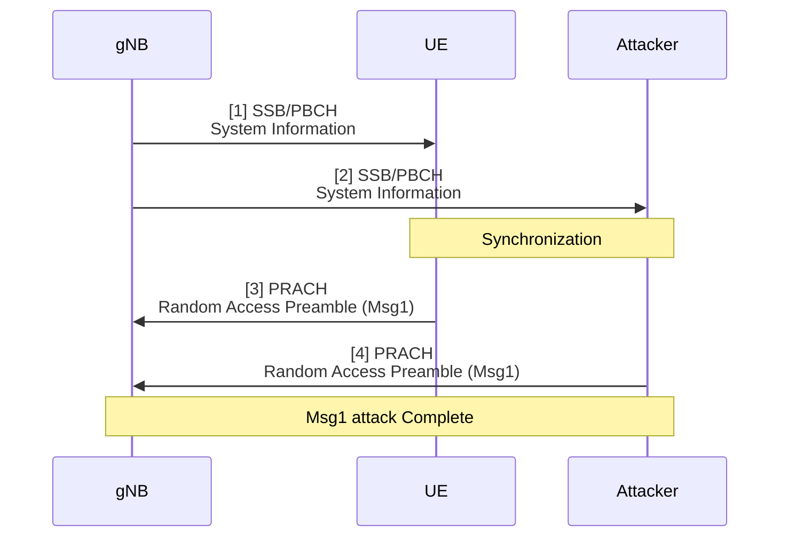
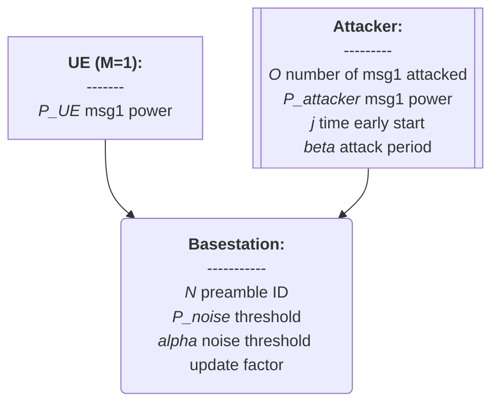
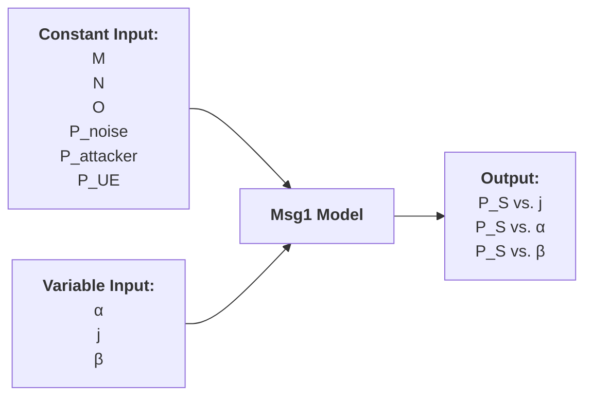
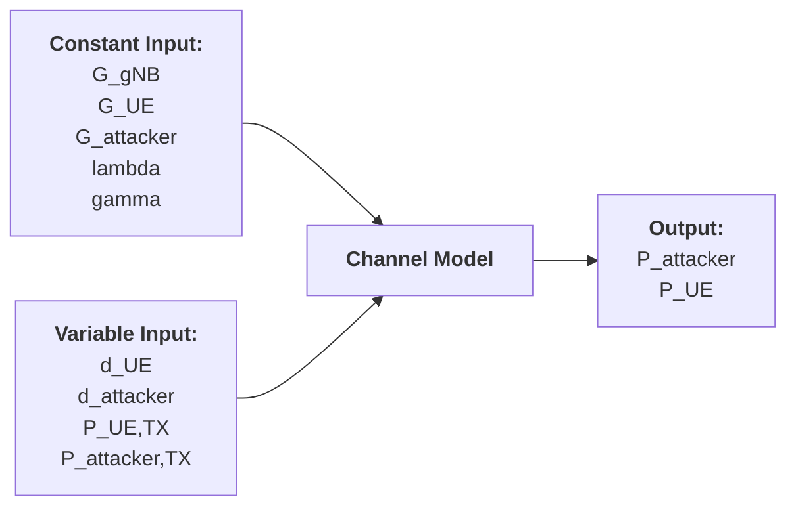

# 20250312 Thesis (Basic Msg1 Simulation)

###### tags: `2025`

**Goal:**
- [x] Write Basic Msg1 Simulation for Analysis of PRACH Attack on Network Energy Saving

**References:**
- Modeling Random Access with Capture and Power Control for IEEE 802.11be Systems
- [Modeling and Estimation of One-Shot Random Access for Finite-User Multichannel Slotted ALOHA Systems](https://ieeexplore.ieee.org/document/6211364)
- [20250310 Thesis (Basic Msg1 Model)](https://github.com/bmw-ece-ntust/wilfrid-prach-attack-analysis/blob/master/docs/20250310%20Thesis%20(Basic%20Msg1%20Model).md)

**Table of Contents:**
- [20250312 Thesis (Basic Msg1 Simulation)](#20250312-thesis--basic-msg1-simulation-)
          + [tags: `2025`](#tags---2025-)
  * [1. System Model](#1-system-model)
    + [1.2. PRACH Msg1 Attack Overview](#12-prach-msg1-attack-overview)
    + [1.2. Actors](#12-actors)
    + [1.3. Timing Diagram](#13-timing-diagram)
  * [2. Basic Model Simulation](#2-basic-model-simulation)
    + [2.1. Model Parameters](#21-model-parameters)
      - [2.1.1. Assumptions or Constant Input Parameter](#211-assumptions-or-constant-input-parameter)
      - [2.1.2. Variable Input Parameter](#212-variable-input-parameter)
      - [2.1.3. Output Parameter or Performance Metrics](#213-output-parameter-or-performance-metrics)
    + [2.2. Simulation Implementation in Python Code](#22-simulation-implementation-in-python-code)
      - [2.2.1. Parameters](#221-parameters)
      - [2.2.2. Code](#222-code)
      - [2.2.3. Result](#223-result)
  * [3. Add UE and Attacker Channel Simulation](#3-add-ue-and-attacker-channel-simulation)
    + [3.1. Model Parameters](#31-model-parameters)
      - [3.1.1. Assumptions or Constant Input Parameter](#311-assumptions-or-constant-input-parameter)
      - [3.1.2. Variable Input Parameter](#312-variable-input-parameter)
      - [3.1.3. Output Parameter or Performance Metrics](#313-output-parameter-or-performance-metrics)
    + [3.2. Modify Code to Add UE and Attacker Channel Model](#32-modify-code-to-add-ue-and-attacker-channel-model)
      - [3.2.1. Parameters](#321-parameters)
      - [3.2.2. Code](#322-code)
      - [3.2.3. Result](#323-result)

<small><i><a href='http://ecotrust-canada.github.io/markdown-toc/'>Table of contents generated with markdown-toc</a></i></small>

## 1. System Model

### 1.2. PRACH Msg1 Attack Overview


### 1.2. Actors



### 1.3. Timing Diagram

```mermaid
---
displayMode: compact
---
gantt
    dateFormat mm
    title beta = 1
    axisFormat %M
    section gNB
    RAO 1 : done, rao1, 00, 5m
    RAO 2 : done, rao2, 10, 5m
    RAO 3 : done, rao3, 20, 5m
    RAO 4 : done, rao4, 30, 5m
    RAO 5 : done, rao5, 40, 5m
    RAO 6 : done, rao5, 50, 5m
    section Attacker
    ‎Msg1 : crit, att1, 00, 5m
    ‎Msg1 : crit, att2, 10, 5m
    ‎Msg1 : crit, att3, 20, 5m
    ‎Msg1 : crit, att4, 30, 5m
    ‎Msg1 : crit, att5, 40, 5m
    ‎Msg1 : crit, att5, 50, 5m
    ‎j : active, j1, 00, 30m
    section UE
    ‎Msg1 : ue1, 30, 5m
    ‎Msg1 : ue2, 40, 5m
    ‎Msg1 : ue3, 50, 5m
```

```mermaid
---
displayMode: compact
---
gantt
    dateFormat mm
    title beta = 0.5
    axisFormat %M
    section gNB
    RAO 1 : done, rao1, 00, 5m
    RAO 2 : done, rao2, 10, 5m
    RAO 3 : done, rao3, 20, 5m
    RAO 4 : done, rao4, 30, 5m
    RAO 5 : done, rao5, 40, 5m
    RAO 6 : done, rao5, 50, 5m
    section Attacker
    ‎Msg1 : crit, att1, 00, 5m
    ‎Msg1 : crit, att3, 20, 5m
    ‎Msg1 : crit, att5, 40, 5m
    ‎j : active, j1, 00, 30m
    section UE
    ‎Msg1 : ue1, 30, 5m
    ‎Msg1 : ue2, 40, 5m
    ‎Msg1 : ue3, 50, 5m
```

```mermaid
---
displayMode: compact
---
gantt
    dateFormat mm
    title beta = 0.25
    axisFormat %M
    section gNB RAO
    RAO 1 : done, rao1, 00, 5m
    RAO 2 : done, rao2, 10, 5m
    RAO 3 : done, rao3, 20, 5m
    RAO 4 : done, rao4, 30, 5m
    RAO 5 : done, rao5, 40, 5m
    RAO 6 : done, rao5, 50, 5m
    section Attacker
    Msg1 : crit, att1, 00, 5m
    ‎Msg1 : crit, att5, 40, 5m
    ‎j : active, j1, 00, 30m
    section UE Msg1
    ‎Msg1 : ue1, 30, 5m
    ‎Msg1 : ue2, 40, 5m
    ‎Msg1 : ue3, 50, 5m
```







## 2. Basic Model Simulation

### 2.1. Model Parameters

#### 2.1.1. Assumptions or Constant Input Parameter

| Parameter      | Description                    | Constant Value |
| -------------- | ------------------------------ | -------------- |
| $M$            | Number of UE                   | 1              |
| $N$            | Number of Preamble ID          | 64             |
| $O$            | Number of Attacked Preamble ID | 1              |
| $P_{noise}$    | Initial Noise dB Threshold     | $x$            |
| $P_{attacker}$ | Attacker's Msg1 dB Power       | $x$            |
| $P_{UE}$       | UE's Msg1 dB Power             | $x$            |

#### 2.1.2. Variable Input Parameter

| Parameter | Description                                                                                         | Value Range    |
| --------- | --------------------------------------------------------------------------------------------------- | -------------- |
| $i$       | identifier for the ith Random Access Occasion                                                       | 0..∞ (integer) |
| $\alpha$  | Noise update factor parameter                                                                       | 0..1 (real)    |
| $j$       | Number of Random Access Occasion early start for attacker relative to UE                            | 0..∞ (integer) |
| $\beta$   | Variability/Percentage of Attack Period. This parameter is directly related to ssb-perRACH-Occasion | 0..1 (real)    |

#### 2.1.3. Output Parameter or Performance Metrics

| Parameter | Description                          | Value Range |
| --------- | ------------------------------------ | ----------- |
| $P_S$     | UE's Msg1 Access Success Probability | 0 or 1      |



### 2.2. Simulation Implementation in Python Code

#### 2.2.1. Parameters

| Parameter      | Description                    | Value |
| -------------- | ------------------------------ | -------------- |
| $P_{noise}$    | Initial Noise dB Threshold     | 28            |
| $P_{attacker}$ | Attacker's Msg1 dB Power       | 55            |
| $P_{UE}$       | UE's Msg1 dB Power             | 54            |
| $\alpha$  | Noise update factor parameter                                                                       | 0.1    |
| $j$       | Number of Random Access Occasion early start for attacker relative to UE                            | 0..110 |
| $\beta$   | Variability/Percentage of Attack Period. This parameter is directly related to ssb-perRACH-Occasion | 1,0.5,0.25,0.125    |


#### 2.2.2. Code

```python
import numpy as np
import matplotlib.pyplot as plt

##### Mathematical #####
def compute_p_success(P_noise, P_attacker, P_UE, alpha, beta_values, j_max):
    j_range = np.arange(1, j_max + 1)
    results_P_S = {}
    results_P_noise_j1 = {}
    
    for beta in beta_values:
        P_noise_values = [P_noise]
        
        for i in range(1, j_max + 1):
            if (i - 2) % (1 / beta) == 0 and i > 1:
                P_next = (1 - alpha) * P_noise_values[-1] + alpha * P_attacker
            else:
                P_next = (1 - alpha) * P_noise_values[-1] + alpha * P_noise
            
            P_noise_values.append(P_next)
        
        P_S = [1 if P_UE > P_noise_values[j] else 0 for j in range(j_max)]
        results_P_S[beta] = P_S

        P_noise_j1 = [P_noise_values[j] for j in range(j_max)]
        results_P_noise_j1[beta] = P_noise_j1
    
    return j_range, results_P_S, results_P_noise_j1

##### Simulation #####
class UE:
    def __init__(self, power):
        self.power = power  # UE Msg1 power

    def check_success(self, noise_threshold):
        return 1 if self.power > noise_threshold else 0

class Attacker:
    def __init__(self, power, beta):
        self.power = power  # Attacker Msg1-like power
        self.beta = beta  # Attack periodicity
    
    def is_active(self, rao):
        return (rao - 2) % (1 / self.beta) == 0 and rao > 1

class gNB:
    def __init__(self, initial_noise, alpha):
        self.noise = initial_noise  # Initial noise threshold
        self.alpha = alpha  # Noise update factor
    
    def update_noise(self, attacker_active, attacker_power, base_noise):
        if attacker_active:
            self.noise = (1 - self.alpha) * self.noise + self.alpha * attacker_power
        else:
            self.noise = (1 - self.alpha) * self.noise + self.alpha * base_noise
        return self.noise

def simulate(j_max, P_noise, P_attacker, P_UE, alpha, beta_values):
    j_range = np.arange(1, j_max + 1)
    results_P_S = {}
    results_P_noise_j1 = {}
    
    for beta in beta_values:
        ue = UE(P_UE)
        attacker = Attacker(P_attacker, beta)
        gnb = gNB(P_noise, alpha)
        
        P_noise_values = [P_noise]
        P_S_values = []
        
        for j in range(j_max):
            attacker_active = attacker.is_active(j+1)
            noise_level = gnb.update_noise(attacker_active, P_attacker, P_noise)
            P_noise_values.append(noise_level)
            P_S_values.append(ue.check_success(noise_level))
        
        results_P_S[beta] = P_S_values
        results_P_noise_j1[beta] = P_noise_values[:j_max]
    
    return j_range, results_P_S, results_P_noise_j1

##### Main Program #####
# Given parameters
P_noise = 28  # dB
P_attacker = 55  # dB
P_UE = 54  # dB
alpha = 0.1
beta_values = [1, 0.5, 0.25, 0.125]
j_max = 110

# Compute results
j_range, math_P_S, math_P_noise_j1 = compute_p_success(P_noise, P_attacker, P_UE, alpha, beta_values, j_max)

# Run simulation
j_range, simu_P_S, simu_P_noise_j1 = simulate(j_max, P_noise, P_attacker, P_UE, alpha, beta_values)

# Plot results
plt.figure(figsize=(12, 6))
plt.subplot(1, 2, 1)
for beta, P_S in math_P_S.items():
    plt.plot(j_range, P_S, linestyle='-', label=f'β = {beta}')
for beta, P_S in simu_P_S.items():
    plt.plot(j_range, P_S, linestyle='none', marker='.', label=f'β = {beta} sim')

plt.xlabel("j (RAO Early Start)")
plt.ylabel("P_S (Msg1 Success Probability)")
plt.title("UE Msg1 Success Probability vs j for Different β Values (Simulation)")
plt.legend()
plt.grid()

plt.subplot(1, 2, 2)
for beta, P_noise_j1 in math_P_noise_j1.items():
    plt.plot(j_range, P_noise_j1, linestyle='-', label=f'β = {beta}')
for beta, P_noise_j1 in simu_P_noise_j1.items():
    plt.plot(j_range, P_noise_j1, linestyle='none', marker='.', label=f'β = {beta} sim')

plt.axhline(P_UE, color='red', ls='dotted')
plt.xlabel("j (RAO Early Start)")
plt.ylabel("P_noise_j1 (gNB's Noise Threshold at j+1)")
plt.title("gNB's Noise Threshold at j+1 vs j for Different β Values (Simulation)")
plt.legend()
plt.grid()

plt.tight_layout()
plt.show()
```

#### 2.2.3. Result

$\alpha = 0.1$


## 3. Add UE and Attacker Channel Simulation

### 3.1. Model Parameters

#### 3.1.1. Assumptions or Constant Input Parameter

| Parameter      | Description              | Constant Value |
| -------------- | ------------------------ | -------------- |
| $G_{gNB}$       | antenna gain of gNB     | $x$            |
| $G_{UE}$       | antenna gain of UE       | $x$            |
| $G_{attacker}$ | antenna gain of attacker | $x$            |
| $\lambda$      | wavelength of the signal | $x$            |
| $\gamma$       | path loss exponent       | $x$            |

#### 3.1.2. Variable Input Parameter

| Parameter         | Description                          | Value Range |
| ----------------- | ------------------------------------ | ----------- |
| $d_{UE}$          | distance between gNB to UE           | 0..∞ (real) |
| $d_{attacker}$    | distance between gNB to attacker     | 0..∞ (real) |
| $P_{UE,TX}$       | UE's Msg1 dB Power (tx by UE)        | 0..∞ (real) |
| $P_{attacker,TX}$ | Attacker's Msg1 dB Power (rx by gNB) | 0..∞ (real) |

#### 3.1.3. Output Parameter or Performance Metrics

| Parameter      | Description                          | Value Range |
| -------------- | ------------------------------------ | ----------- |
| $P_{attacker}$ | Attacker's Msg1 dB Power (rx by gNB) | 0..∞ (real) |
| $P_{UE}$       | UE's Msg1 dB Power (rx by gNB)       | 0..∞ (real) |



### 3.2. Modify Code to Add UE and Attacker Channel Model

#### 3.2.1. Parameters

| Parameter         | Description                          | Value       |
| ----------------- | ------------------------------------ | ----------- |
| $G_{gNB}$         | antenna gain of gNB                  | 1           |
| $G_{UE}$          | antenna gain of UE                   | 1           |
| $G_{attacker}$    | antenna gain of attacker             | 1           |
| $\lambda$         | wavelength of the signal             | 1           |
| $\gamma$          | path loss exponent                   | 4pi         |
| $d_{UE}$          | distance between gNB to UE           | 1           |
| $d_{attacker}$    | distance between gNB to attacker     | 1           |
| $P_{UE,TX}$       | UE's Msg1 dB Power (tx by UE)        | 54          |
| $P_{attacker,TX}$ | Attacker's Msg1 dB Power (rx by gNB) | 55          |

#### 3.2.2. Code

```python

```

#### 3.2.3. Result

$\alpha = 0.1$


