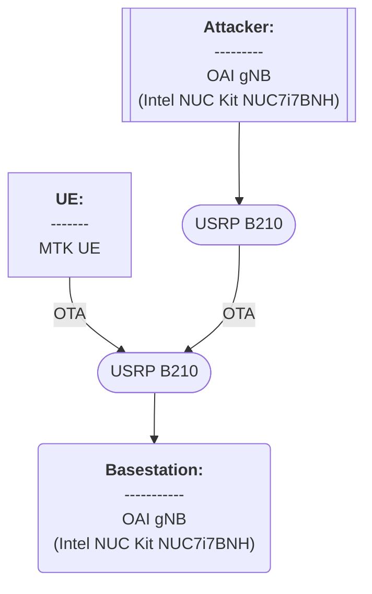

# 20250313 Thesis (Test of PRACH Attacker for Basic Msg1 Model)

###### tags: `2025`


**Goal:**
- [x] [Test PRACH Attacker for Basic Msg1 Model]()

**References:**
- [OAI 5G NR SA tutorial with OAI nrUE](https://gitlab.eurecom.fr/oai/openairinterface5g/-/blob/develop/doc/NR_SA_Tutorial_OAI_nrUE.md?ref_type=heads)
- [OAI UE + USRP B210 Installation Guide](https://hackmd.io/@zhongxin/BJSPWUy90)
- [Attacker guide for Wilfrid paper](https://ntust-bmwlab.notion.site/Attacker-guide-for-Wilfrid-paper-12d1009831438064b6afcf322b4fa252)

**Table of Contents:**
<small><i><a href='http://ecotrust-canada.github.io/markdown-toc/'>Table of contents generated with markdown-toc</a></i></small>


## 0. Summary

1. abc

## 1. PRACH Attacker for Basic Msg1 Model

| Step                                      | Status             |
| ----------------------------------------- | ------------------ |
| gNB Run                                  | :heavy_check_mark: |
| Attacker Run                                  | :heavy_check_mark: |
| UE Run                   | :heavy_check_mark: |
| Data Compiled                   | :heavy_check_mark: |

### 1.0. Minimum Requirement

- [Source](https://gitlab.eurecom.fr/oai/openairinterface5g/-/blob/develop/doc/system_requirements.md)

#### 1.0.1. OAI gNB with USRP

<b>Hardware:</b>

| Item   | Info       |
| ------ | ---------- |
| CPU    |  |
| Memory |         |

<b>Software:</b>

| Item | Info            |
| ---- | --------------- |
| OS   |  |

#### 1.0.2. OAI UE with USRP for attacker

<b>Hardware:</b>

| Item   | Info       |
| ------ | ---------- |
| CPU    |  |
| Memory |         |

<b>Software:</b>

| Item | Info            |
| ---- | --------------- |
| OS   |  |

### 1.1. Topology



### 1.2. Environment

#### 1.2.1. OAI gNB

<b>Hardware:</b>

| Item         | Info                                                         |
| ------------ | ------------------------------------------------------------ |
| CPU          | Intel(R) Core(TM) i7-7567U CPU @ 3.50GHz |
| Memory       | 8GB                                               |
| Disk         | 922GB                                                        |
| Server Model | Intel Corporation NUC7i7BNH J31153-310                               |

Command Line Codes
```shell=
# Check CPU Type, freq, cores, numbers
lscpu

# Check total memory
sudo lshw -C memory

# Check total disk
df -h
df --total -h | grep 'total' | awk '{print $2}'

# Check server model
sudo dmidecode -t system
```

<b>Software:</b>

| Item       | Info                                                                                                    |
| ---------- | ------------------------------------------------------------------------------------------------------- |
| OS         | Ubuntu 22.04.4 LTS (jammy)                                                                              |
| Kernel     | 6.8.0-52-generic                                                                                    |
| OAI Commit |  |

Command Line Codes
```shell=
# Check OS
lsb_release -a

# Check kernel
uname -a
uname -r

# Check OAI commit
git log -1
```

#### 1.2.2. OAI UE for attacker

<b>Hardware:</b>

| Item         | Info                                                         |
| ------------ | ------------------------------------------------------------ |
| CPU          | Intel(R) Core(TM) i7-7567U CPU @ 3.50GHz |
| Memory       | 8GB                                               |
| Disk         | 922GB                                                        |
| Server Model |                                  |

Command Line Codes
```shell=
# Check CPU Type, freq, cores, numbers
lscpu

# Check total memory
sudo lshw -C memory

# Check total disk
df -h
df --total -h | grep 'total' | awk '{print $2}'

# Check server model
sudo dmidecode -t system
```


<b>Software:</b>

| Item       | Info                                                                                                    |
| ---------- | ------------------------------------------------------------------------------------------------------- |
| OS         |  Ubuntu 22.04.4 LTS (jammy)                                                                             |
| Kernel     |  6.8.0-52-generic                                                                                   |
| OAI Commit |  |

Command Line Codes
```shell=
# Check OS
lsb_release -a

# Check kernel
uname -a
uname -r

# Check OAI commit
git log -1
```


### 1.3. Compile

<b>1. Get openairinterface5g source code</b>

```shell=
# Get openairinterface5g source code
git clone https://gitlab.eurecom.fr/oai/openairinterface5g.git ~/openairinterface5g
cd ~/openairinterface5g
git checkout develop
git log -1
```

<b>2. Install OAI dependencies</b>

```shell=
# Install OAI dependencies
cd ~/openairinterface5g/cmake_targets
./build_oai -I
```

<b>3. nrscope dependencies</b>

```shell=
# nrscope dependencies
sudo apt install -y libforms-dev libforms-bin
```


<b>4. Build OAI gNB</b>

```shell=
# Build OAI gNB
cd ~/openairinterface5g/cmake_targets
./build_oai -w SIMU --ninja --nrUE --gNB --build-lib "nrscope" -C
```


### 1.4. Run

#### 1.4.1. Configuration

##### 1.4.1.1. gNB Configuration

<b>1. We use example configuration from `/targets/PROJECTS/GENERIC-NR-5GC/CONF/gnb.sa.band78.fr1.106PRB.usrpb210.conf`</b>

<b>2. Be aware that you might need to change 3 things in the configuration file:</b>
- AMF and Network Interface Parameters (modify as your AMF and gNB ip address. Values that I use is below)
```shell=
////////// AMF parameters:
amf_ip_address = ({ ipv4 = "127.0.0.5"; }); 


NETWORK_INTERFACES :
{
    GNB_IPV4_ADDRESS_FOR_NG_AMF              = "127.0.0.17"; 
    GNB_IPV4_ADDRESS_FOR_NGU                 = "127.0.0.18"; 
    GNB_PORT_FOR_S1U                         = 2152; # Spec 2152
};
```
- PLMN List (modify as your desired Slice Configuration. Values that I use is below)
```shell=
plmn_list = ({ mcc = 001; mnc = 01; mnc_length = 2; snssaiList = ({ sst = 1}) });
```
- min_rxtxtime (modify as your desired min_rxtxtime. Values that I use is below)
```shell=
# i use this because i cannot pass --gNBs.[0].min_rxtxtime 6 when running OAI gNB
gNBs =
(
 {
    ...
    min_rxtxtime = 6; # value 6 is because default USRP value
    ...
```

##### 1.4.1.2. UE Configuration

<b>1. We use example configuration from `/ci-scripts/conf_files/nrue.uicc.conf`</b>

<b>2. Be aware that you might need to change 3 things in the UE configuration file:</b>
- imsi (modify as your desired ue identity. Values that I use is below)
```shell=
imsi = "001010000000001";
```
- nssai_sst & nssai_sd (modify as your desired Slice Configuration. Values that I use is below)
```shell=
nssai_sst=1;
```
- dnn (modify as your desired DNN. Values that I use is below)
```shell=
dnn="internet";
```

#### 1.4.2. Result

##### 1.4.2.1. Initial Run

<b>1. Run OAI gNB</b>

```shell=
cd ~/openairinterface5g/cmake_targets/ran_build/build
# sudo ./nr-softmodem -O ../../../targets/PROJECTS/GENERIC-NR-5GC/CONF/gnb.sa.band78.fr1.106PRB.usrpb210.conf --gNBs.[0].min_rxtxtime 6 --rfsim --sa
sudo ./nr-softmodem -O ../../../targets/PROJECTS/GENERIC-NR-5GC/CONF/gnb.sa.band78.fr1.106PRB.usrpb210.conf --rfsim --sa
```

<b>2. Run OAI nrUE</b>

```shell=
cd ~/openairinterface5g/cmake_targets/ran_build/build
sudo ./nr-uesoftmodem --rfsim --rfsimulator.serveraddr 127.0.0.1 --sa -r 106 --numerology 1 --band 78 -C 3619200000 -O ../../../ci-scripts/conf_files/nrue.uicc.conf
```

<b>3. Stop OAI UE, OAI gNB and open5gs</b>

```shell=
# To stop OAI UE, just ctrl + c on OAI UE terminal

# To stop OAI UE, just ctrl + c on OAI gNB terminal

# Stop open5gs
./stop_open5gs.sh
```

<b>4. Result explanation</b>
- Since we set the 5G System (CN, RAN & UE) to have only 1 slice, we can see that there is only 1 slice (both on Allowed NSSAI & PDU Session)

##### 1.4.2.2. Modify OAI UE slice configuration

<b>1. Run OAI gNB</b>

```shell=
cd ~/openairinterface5g/cmake_targets/ran_build/build
# sudo ./nr-softmodem -O ../../../targets/PROJECTS/GENERIC-NR-5GC/CONF/gnb.sa.band78.fr1.106PRB.usrpb210.conf --gNBs.[0].min_rxtxtime 6 --rfsim --sa
sudo ./nr-softmodem -O ../../../targets/PROJECTS/GENERIC-NR-5GC/CONF/gnb.sa.band78.fr1.106PRB.usrpb210.conf --rfsim --sa
```

<b>2. Run OAI nrUE</b>

```shell=
cd ~/openairinterface5g/cmake_targets/ran_build/build
sudo ./nr-uesoftmodem --rfsim --rfsimulator.serveraddr 127.0.0.1 --sa -r 106 --numerology 1 --band 78 -C 3619200000 -O ../../../ci-scripts/conf_files/nrue.uicc.conf
```

<b>3. Result explanation</b>
- Since we set the 5G System (CN & RAN) to have only 1 slice sst=1, we can see that there is only 1 slice on Allowed NSSAI
