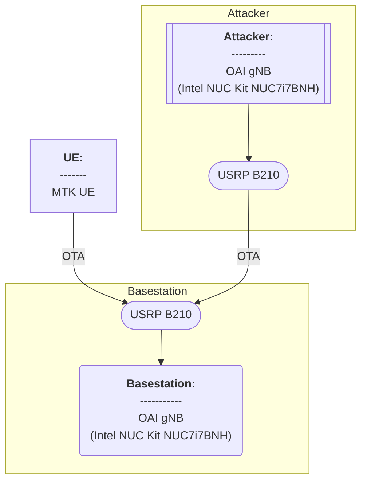

# 20250313 Thesis (Test of PRACH Attacker for Basic Msg1 Model)

###### tags: `2025`


**Goal:**
- [x] [Test PRACH Attacker for Basic Msg1 Model]()

**References:**
- [OAI 5G NR SA tutorial with OAI nrUE](https://gitlab.eurecom.fr/oai/openairinterface5g/-/blob/develop/doc/NR_SA_Tutorial_OAI_nrUE.md?ref_type=heads)
- [OAI UE + USRP B210 Installation Guide](https://hackmd.io/@zhongxin/BJSPWUy90)
- [Attacker guide for Wilfrid paper](https://ntust-bmwlab.notion.site/Attacker-guide-for-Wilfrid-paper-12d1009831438064b6afcf322b4fa252)

**Table of Contents:**
- [20250313 Thesis (Test of PRACH Attacker for Basic Msg1 Model)](#20250313-thesis--test-of-prach-attacker-for-basic-msg1-model-)
          + [tags: `2025`](#tags---2025-)
  * [0. Summary](#0-summary)
  * [1. PRACH Attacker for Basic Msg1 Model](#1-prach-attacker-for-basic-msg1-model)
    + [1.0. Minimum Requirement](#10-minimum-requirement)
      - [1.0.1. OAI gNB with USRP](#101-oai-gnb-with-usrp)
      - [1.0.2. OAI UE with USRP for attacker](#102-oai-ue-with-usrp-for-attacker)
    + [1.1. Topology](#11-topology)
    + [1.2. Environment](#12-environment)
      - [1.2.1. OAI gNB](#121-oai-gnb)
      - [1.2.2. OAI UE for attacker](#122-oai-ue-for-attacker)
    + [1.3. Compile](#13-compile)
      - [1.3.1. Compile gNB](#131-compile-gnb)
      - [1.3.2. Compile Attacker](#132-compile-attacker)
    + [1.4. Run](#14-run)
      - [1.4.1. Configuration](#141-configuration)
        * [1.4.1.1. gNB Configuration](#1411-gnb-configuration)
        * [1.4.1.2. Attacker Configuration](#1412-attacker-configuration)
      - [1.4.2. Result](#142-result)
        * [1.4.2.1. Initial Run](#1421-initial-run)
        * [1.4.2.2. Modify OAI UE slice configuration](#1422-modify-oai-ue-slice-configuration)

<small><i><a href='http://ecotrust-canada.github.io/markdown-toc/'>Table of contents generated with markdown-toc</a></i></small>

## 0. Summary

1. abc

## 1. PRACH Attacker for Basic Msg1 Model

| Step                        | Status             |
| --------------------------- | ------------------ |
| gNB Run                     | :heavy_check_mark: |
| Attacker Run                | :heavy_check_mark: |
| Attacker Sync to gNB        | :heavy_check_mark: |
| Attacker Send Msg1 to gNB   | :heavy_check_mark: |
| UE Run and Send Msg1 to gNB | :heavy_check_mark: |
| Data Compiled               | :heavy_check_mark: |

### 1.0. Minimum Requirement

- [Source](https://gitlab.eurecom.fr/oai/openairinterface5g/-/blob/develop/doc/system_requirements.md)

#### 1.0.1. OAI gNB with USRP

<b>Hardware:</b>

| Item   | Info       |
| ------ | ---------- |
| CPU    |  |
| Memory |         |

<b>Software:</b>

| Item | Info            |
| ---- | --------------- |
| OS   |  |

#### 1.0.2. OAI UE with USRP for attacker

<b>Hardware:</b>

| Item   | Info       |
| ------ | ---------- |
| CPU    |  |
| Memory |         |

<b>Software:</b>

| Item | Info            |
| ---- | --------------- |
| OS   |  |

### 1.1. Topology



### 1.2. Environment

#### 1.2.1. OAI gNB

<b>Hardware:</b>

| Item         | Info                                     |
| ------------ | ---------------------------------------- |
| CPU          | Intel(R) Core(TM) i7-7567U CPU @ 3.50GHz |
| Memory       | 8GB                                      |
| Disk         | 922GB                                    |
| Server Model | Intel Corporation NUC7i7BNH J31153-310   |

Command Line Codes
```shell=
# Check CPU Type, freq, cores, numbers
lscpu

# Check total memory
sudo lshw -C memory

# Check total disk
df -h
df --total -h | grep 'total' | awk '{print $2}'

# Check server model
sudo dmidecode -t system
```

<b>Software:</b>

| Item       | Info                       |
| ---------- | -------------------------- |
| OS         | Ubuntu 22.04.4 LTS (jammy) |
| Kernel     | 6.8.0-52-generic           |
| OAI Commit | 60b0c1827dbda37e1b2d0dfc91227d6ce9826827 (HEAD -> develop, origin/develop, origin/HEAD)                           |

Command Line Codes
```shell=
# Check OS
lsb_release -a

# Check kernel
uname -a
uname -r

# Check OAI commit
git log -1
```

#### 1.2.2. OAI UE for attacker

<b>Hardware:</b>

| Item         | Info                                     |
| ------------ | ---------------------------------------- |
| CPU          | Intel(R) Core(TM) i7-7567U CPU @ 3.50GHz |
| Memory       | 8GB                                      |
| Disk         | 922GB                                    |
| Server Model |                                          |

Command Line Codes
```shell=
# Check CPU Type, freq, cores, numbers
lscpu

# Check total memory
sudo lshw -C memory

# Check total disk
df -h
df --total -h | grep 'total' | awk '{print $2}'

# Check server model
sudo dmidecode -t system
```


<b>Software:</b>

| Item       | Info                       |
| ---------- | -------------------------- |
| OS         | Ubuntu 22.04.4 LTS (jammy) |
| Kernel     | 6.8.0-52-generic           |
| OAI Commit |                            |

Command Line Codes
```shell=
# Check OS
lsb_release -a

# Check kernel
uname -a
uname -r

# Check OAI commit
git log -1
```


### 1.3. Compile


#### 1.3.1. Compile gNB

<b>1. Install USRP B210 dependency</b>

```shell=
sudo apt install -y autoconf automake build-essential ccache cmake cpufrequtils doxygen ethtool g++ git inetutils-tools libboost-all-dev libncurses5 libncurses5-dev libusb-1.0-0 libusb-1.0-0-dev libusb-dev python3-dev python3-mako python3-numpy python3-requests python3-scipy python3-setuptools python3-ruamel.yaml
```

<b>2. Build UHD from source</b>

```shell=
git clone https://github.com/EttusResearch/uhd.git
cd uhd
git checkout v4.6.0.0
cd host
mkdir build
cd build
cmake ../
make -j $(nproc)
make test # This step is optional
sudo make install
sudo ldconfig
```

<b>3. Download FPGA Image</b>

```shell=
sudo uhd_images_downloader
```

<b>4. Install Gnuradio</b>

```shell=
sudo apt install gnuradio
```

<b>5. Check if the system can recognise B210 through USB</b>

```shell=
lsusb
```


<b>6. Test the device with uhd to see if it works</b>

```shell=
sudo uhd_find_devices
```


<b>7. Download OAI gNB from gitlab</b>

```shell=
git clone https://gitlab.eurecom.fr/oai/openairinterface5g.git
cd openairinterface5g
git checkout develop
```


<b>8. Dependency</b>

```shell=
cd cmake_targets
./build_oai -I
```


<b>9. Install nrscope</b>

```shell=
sudo apt install -y libforms-dev libforms-bin
```


<b>10. Optional Reinstall yaml-cpp</b>

```shell=
# this is optional
# sometimes, the yaml-cpp library is broken, so will result in error of step 11
sudo apt update
sudo apt install --reinstall libyaml-cpp-dev
```


<b>11. Build oai gNB with USRP mode</b>

```shell=
./build_oai -w USRP --ninja --nrUE --gNB --build-lib "nrscope" -C
```


#### 1.3.2. Compile Attacker


<b>1. Install USRP B210 dependency</b>

```shell=
sudo apt install -y autoconf automake build-essential ccache cmake cpufrequtils doxygen ethtool g++ git inetutils-tools libboost-all-dev libncurses5 libncurses5-dev libusb-1.0-0 libusb-1.0-0-dev libusb-dev python3-dev python3-mako python3-numpy python3-requests python3-scipy python3-setuptools python3-ruamel.yaml
```

<b>2. Build UHD from source</b>

```shell=
git clone https://github.com/EttusResearch/uhd.git
cd uhd
git checkout v4.6.0.0
cd host
mkdir build
cd build
cmake ../
make -j $(nproc)
make test # This step is optional
sudo make install
sudo ldconfig
```

<b>3. Download FPGA Image</b>

```shell=
sudo uhd_images_downloader
```

<b>4. Install Gnuradio</b>

```shell=
sudo apt install gnuradio
```

<b>5. Check if the system can recognise B210 through USB</b>

```shell=
lsusb
```


<b>6. Test the device with uhd to see if it works</b>

```shell=
sudo uhd_find_devices
```


<b>7. Clone MSG1 Attacker and checkout to rework_UE branch</b>

```shell=
git clone https://github.com/Richard-yq/OAI-UE-MSG1-attacker.git
cd  OAI-UE-MSG1-attacker
git checkout rework_UE
```

<b>8. Install ASN.1</b>

```shell=
cd cmake_targets
sudo ./build_oai -I
```

<b>9. Install nrscope</b>

```shell=
sudo apt install -y libforms-dev libforms-bin
```

<b>10. Install nrscope</b>

```shell=
./build_oai -w USRP --ninja --nrUE --gNB --build-lib "nrscope" -C
```

### 1.4. Run

#### 1.4.1. Configuration

##### 1.4.1.1. gNB Configuration

<b>1. We use example configuration from `/targets/PROJECTS/GENERIC-NR-5GC/CONF/gnb.sa.band78.fr1.106PRB.usrpb210.conf`</b>

<b>2. Be aware that you might need to change 3 things in the configuration file:</b>
- AMF and Network Interface Parameters (modify as your AMF and gNB ip address. Values that I use is below)
```shell=
////////// AMF parameters:
amf_ip_address = ({ ipv4 = "127.0.0.5"; }); 


NETWORK_INTERFACES :
{
    GNB_IPV4_ADDRESS_FOR_NG_AMF              = "127.0.0.17"; 
    GNB_IPV4_ADDRESS_FOR_NGU                 = "127.0.0.18"; 
    GNB_PORT_FOR_S1U                         = 2152; # Spec 2152
};
```
- PLMN List (modify as your desired Slice Configuration. Values that I use is below)
```shell=
plmn_list = ({ mcc = 001; mnc = 01; mnc_length = 2; snssaiList = ({ sst = 1}) });
```
- min_rxtxtime (modify as your desired min_rxtxtime. Values that I use is below)
```shell=
# i use this because i cannot pass --gNBs.[0].min_rxtxtime 6 when running OAI gNB
gNBs =
(
 {
    ...
    min_rxtxtime = 6; # value 6 is because default USRP value
    ...
```

##### 1.4.1.2. Attacker Configuration

<b>We directly pass attacker's simulated UE configuration through command line</b>

#### 1.4.2. Result

##### 1.4.2.1. Initial Run

<b>1. Run OAI gNB</b>

```shell=
cd openairinterface5g/cmake_target/ran_build/build
sudo ./nr-softmodem -O ../../../targets/PROJECTS/GENERIC-NR-5GC/CONF/gnb.sa.band78.fr1.106PRB.usrpb210.conf --gNBs.[0].min_rxtxtime 6 --sa -E --continuous-tx --log_config.PRACH_debug
```


<b>2. Run Attacker</b>

```shell=
cd OAI-UE-MSG1-attacker/cmake_target/ran_build/build
sudo ./nr-uesoftmodem -r 106 --numerology 1 --band 78 -C 3619200000 --ssb 516 -E --ue-fo-compensation
```


<b>3. Result explanation</b>
- Since we set the 5G System (CN, RAN & UE) to have only 1 slice, we can see that there is only 1 slice (both on Allowed NSSAI & PDU Session)

##### 1.4.2.2. Modify OAI UE slice configuration

