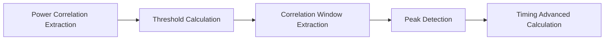

# Paper (IEEE Globecom 2025)

###### tags: `2025`

**Goal:**
- [ ] Write paper agenda

**References:**
- [2025/02/24 Study Note (Paper Survey for PRACH Attack Impact on Energy Saving)](https://github.com/bmw-ece-ntust/wilfrid-prach-attack-analysis/blob/master/docs/20250224%20Study%20Note%20(Paper%20Survey%20for%20PRACH%20Attack%20Impact%20on%20Energy%20Saving).md)
- [Call for Symposium Papers](https://globecom2025.ieee-globecom.org/call-symposium-papers)
- [CISS Symposium](https://globecom2025.ieee-globecom.org/sites/globecom2025.ieee-globecom.org/files/GC25-CFP-CISS.pdf)

**Table of Contents:**
- [Paper (IEEE Globecom 2025)](#paper--ieee-globecom-2025-)
          + [tags: `2025`](#tags---2025-)
  * [1. Paper Requirements](#1-paper-requirements)
  * [2. Paper Abstract](#2-paper-abstract)
  * [3. Paper Agenda](#3-paper-agenda)

<small><i><a href='http://ecotrust-canada.github.io/markdown-toc/'>Table of contents generated with markdown-toc</a></i></small>

## 1. Paper Requirements

<b>Max. Pages:</b> 6

<b>Deadline:</b> 1 April 2025

<b>Topic of Interest:</b> Attack prediction, detection, response, and prevention

## 2. Paper Abstract

This paper investigates the impact of jamming attacks on the random access channel (RACH) of cellular networks. We implemented a jamming attacker by modifying the OpenAirInterface (OAI) user equipment (UE). The attacker transmits Message 1 (Msg1) without responding to Message 2 (Msg2), gradually increasing the noise level detected by the Next Generation Node B (gNB). Through real-world testing, we demonstrate that an early-starting attacker can raise the gNB noise threshold, preventing commercial UEs from successfully connecting. To quantify this effect, we develop a mathematical model that predicts the probability of successful UE access based on attacker period, gNB noise updating parameters, and other system variables. Our experimental results validate the accuracy of our model, showing close alignment between theoretical predictions and real-world behavior. Based on these findings, we propose attack strategies for increased effectiveness and countermeasures for gNBs, such as adaptive noise threshold adjustments to mitigate the impact of jamming.

## 3. Paper Agenda
<b>I. Introduction</b>
- Background on 4-Step and 2-Step RACH
  - 4-step RACH process:
    - Msg1 (preamble transmission) → Msg2 (random access response) → Msg3 (UE contention resolution) → Msg4 (contention resolution confirmation).
    - Ensures reliable synchronization but has higher signaling overhead and latency.
  - 2-step RACH process:
    - MsgA (Msg1 + Msg3) → MsgB (Msg2 + Msg4).
    - Reduces access latency and signaling overhead but increases preamble collision risks.
  - Our focus:
    - 5G deployments primarily use 4-step RACH, so we analyze its vulnerabilities.
    - Specifically, we study Msg1-based jamming attacks that exploit the contention-based nature of Msg1.
- Related Work: RACH Jamming Attacks in 5G
  - Existing jamming attack studies:
    - Brute-force jamming: Attacker transmits high-power noise to block RACH opportunities.
    - Protocol-aware jamming: Attacker selectively sends Msg1-like signals to interfere with contention.
  - Key findings from prior work:
    - Jamming increases preamble collisions and reduces UE connection probability.
    - Prior studies focus on attack implementation rather than predictive modeling.
    - Most works lack real-world validation through testbed experiments.
  - Our focus:
    - We specifically study Msg1-based jamming where an adversary transmits valid Msg1 preambles to manipulate the gNB noise threshold and degrade UE access.
- Background on Msg1 Detection and Noise Threshold Models
  - Msg1 detection techniques at the gNB:
    - Based on preamble correlation and threshold-based detection algorithms.
  - Importance of noise threshold in PRACH detection:
    - Affects false alarms and missed detections.
    - Needs dynamic adaptation to maintain detection accuracy.
  - Key gaps in existing research:
    - Prior studies do not explicitly model how attackers manipulate the noise threshold.
    - Our contribution: Develop a mathematical model to quantify the impact of Msg1 jamming on noise threshold and UE connection probability.
-  Gap Analysis & Motivation for Our Work
  - Identified gaps in prior work:
    - No existing study provides a predictive mathematical model for Msg1-based RACH jamming.
    - No prior work validates theoretical models with real-world 5G testbed experiments.
  - How we address these gaps:
    - We develop an analytical model to predict the effect of Msg1 jamming on noise threshold and UE access.
    - We validate our model using OpenAirInterface-based 5G testbed experiments.
- Problem Statement
  - Key research questions:
    - How does a Msg1-based RACH jamming attack affect the gNB noise threshold?
    - How can we mathematically model the probability of a UE successfully connecting under such an attack?
- Contributions
  - Develop an OpenAirInterface-based jamming attacker that transmits Msg1 without responding to Msg2, increasing the gNB noise threshold.
  - Derive a mathematical model predicting noise accumulation and UE connection probability under attack.
  - Validate our model through real-world 5G testbed experiments, comparing theoretical vs. observed results.
  - Propose countermeasures such as adaptive noise thresholding to mitigate Msg1-based RACH jamming.

<b>III. System Model & Problem Definition</b>
- Subsection 1: Network Model
  - Define the network setup:
    - Entities: gNB, legitimate UEs, attacker UE.
    - Describe RACH process and how a UE normally connects.
- Subsection 2: Attacker Model
  - Explain the attacker's strategy:
    - Transmits Msg1 repeatedly but never responds to Msg2.
    - Effect: Increases gNB noise floor, preventing legitimate UEs from connecting.
- Subsection 3: Key System Parameters
  - Define critical variables:
    - P noise : gNB noise threshold.
    - P attacker : Attacker's Msg1 power.
    - α: Noise update factor.
    - T a : Attacker’s Msg1 transmission period.
    - P UE : UE’s Msg1 power.
  - Problem Formulation
    - How does P noise evolve over time under attack?
    - Under what conditions can P UE > P noise and P attacker​ so the UE can still connect?

<b>IV. Mathematical Analysis of Jamming Impact</b>
- Subsection 1: Noise Threshold Evolution
  - Develop an equation for P noise accumulation over multiple RACH slots.
- Subsection 2: Probability of UE Success
  - Derive the probability function for a legitimate UE to connect.
- Subsection 3: Model Predictions & Insights
  - Analyze how attacker transmission frequency T a and power P attacker affect UE connectivity.

<b>V. Experimental Setup & Validation</b>
- Subsection 1: 5G Testbed Setup
  - Describe hardware & software:
    - gNB: OpenAirInterface gNB on USRP B210.
    - UE: Commercial UE attempting RACH access.
    - Attacker: OAI-based jamming UE.
- Subsection 2: Experimental Method & Parameters
  - Ignore Msg1 Method:
    - gNB ignores attacker Msg1 before UE Msg1.
    - gNB ignores k legitimate UE Msg1 transmissions.
  - Define tested attack conditions:
    - T a values: 1, 2, 4 frame intervals.
    - α values: 0.18, 0.12, 0.06, 0.
    - δ: Msg1 detection margin.
- Subsection 3: Results & Model Validation
  - Compare mathematical predictions vs. experimentally observed results.
  - Show graphs of P noise increase and UE success probability trends.

<b>VI. Attack Strategies & Countermeasures</b>
- Subsection 1: Optimizing the Attack
  - Identify optimal attacker period and power level for maximum disruption.
- Subsection 2: Defensive Mechanisms for gNBs
  - Adaptive Noise Thresholding: Dynamically adjust P noise to ignore attack influence.
  - Machine Learning-Based Detection: Identify anomalies in Msg1 transmission patterns.

<b>VII. Conclusion & Future Work</b>
- Summary of Key Findings
  - RACH jamming effectively blocks UE access by increasing P noise.
  - Our mathematical model accurately predicts attack impact.
  - Experimental results validate the model.
- Future Directions
  - Implement real-time detection mechanisms.
  - Extend the model to multiple attackers.

## 4. Figures

## 5. Paper Pending Questions

<b>Question 1: How can the gNB detect the attacker?</b>
Detection Ideas:
1. Preamble Collision Frequency Analysis:
  - The attacker uses Msg1-like transmissions but never completes the 4-step handshake.
  - gNB can monitor preambles that repeatedly result in no Msg3 and flag those as suspicious.
  - Statistical anomaly: if a preamble has many Msg1s with no subsequent Msg3, it could be malicious.
2. Signal Pattern Differentiation:
  - Use RF fingerprinting to detect subtle differences in waveform characteristics (e.g., I/Q imbalance, phase noise).
  - The attacker may use SDRs that behave slightly differently from commercial UEs.
3. Geolocation / TDoA Analysis:
  - If the gNB is part of a multi-cell setup, triangulate signal sources using Time Difference of Arrival (TDoA) to detect fixed-position attackers.
  - Legitimate UEs are more mobile and scattered.
4. Threshold Saturation Monitoring:
  - Rapid or periodic threshold increases (e.g., a rising trend in ​theta_t across PRACH occasions) can indicate attack activity.
  - Could be combined with a simple moving average filter to distinguish natural fluctuations from malicious injection.
5. Ignore Msg1 + Logging:
  - Your proposed “Ignore Msg1” method can be enhanced to log Msg1s that are discarded.
  - Analyze logs for patterns: repeated messages from same power range or timing region can point to an attacker.
6. Unusual Msg1 Power Patterns:
  - Legitimate Msg1 power is based on the estimated pathloss.
  - Attackers may have abnormal Tx power (too high or too low for the expected UE range).
  - A power classifier can tag those transmissions.

<b>Question 2: Can the attacker know the noise model used in each gNB?</b>
Attacker Knowledge Possibilities:
1. If the Noise Model Is Static or Public:
  - If theta_0, α, and update formulas are standardized or known (e.g., 3GPP spec or vendor defaults), an attacker can guess or estimate them.
  - They can simulate threshold evolution offline based on observed Msg1 success or rejection patterns.
2. By Monitoring Rejection Behavior:
  - An attacker can reverse-engineer the threshold by:
    - Sending Msg1s at varying power levels.
    - Observing whether it receives Msg2 (or silence).
    - Bracketing the current theta_t by binary search.
3. Machine Learning on the Air Interface:
  - A persistent attacker can use reinforcement learning to probe different Tx powers and PRACH occasions, gradually learning the mapping between power and acceptance/rejection probability.
4. Threshold Saturation Feedback:
  - If the attacker sees an increasing number of Msg1s getting accepted or rejected at certain power levels over time, it can infer threshold trends and adapt its transmission behavior.
