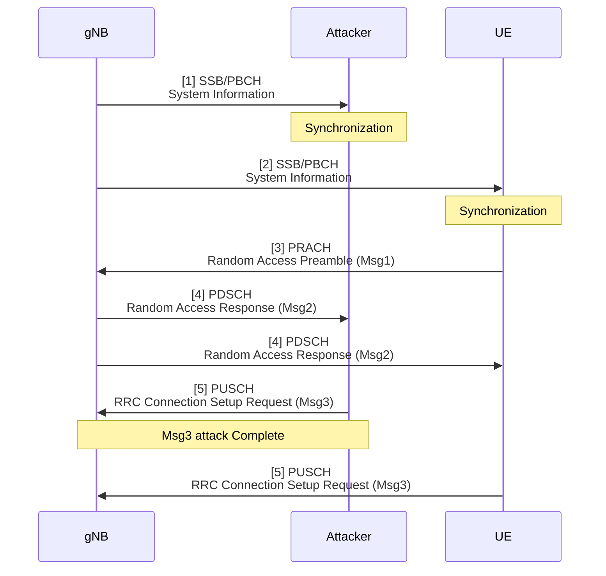
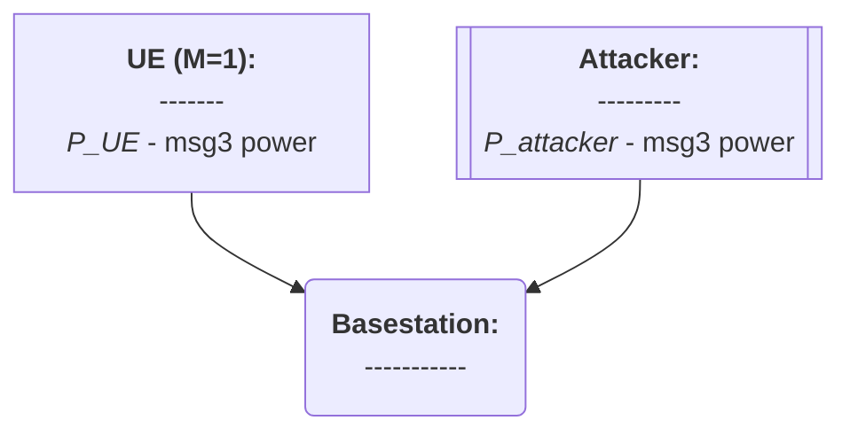
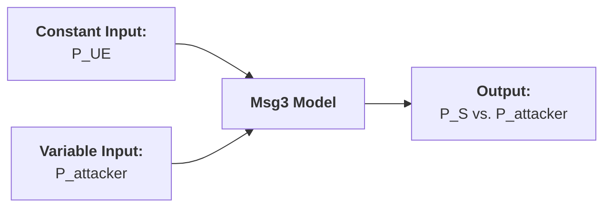

# Thesis (Basic Msg3 Model)

###### tags: `2025`

**Goal:**
- [x] Write Basic Msg3 Model for Analysis of PRACH Attack on Network Energy Saving

**References:**
- Modeling Random Access with Capture and Power Control for IEEE 802.11be Systems
- [Modeling and Estimation of One-Shot Random Access for Finite-User Multichannel Slotted ALOHA Systems](https://ieeexplore.ieee.org/document/6211364)
- [20250307 Thesis (PRACH Attack Problem Definition)](https://github.com/bmw-ece-ntust/wilfrid-prach-attack-analysis/blob/master/docs/20250307%20Thesis%20(PRACH%20Attack%20Problem%20Definition).md)
- [Wireless Communications: Principles and Practice](https://www.amazon.com/Wireless-Communications-Principles-Practice-2nd/dp/0130422320)

**Table of Contents:**
<small><i><a href='http://ecotrust-canada.github.io/markdown-toc/'>Table of contents generated with markdown-toc</a></i></small>

## 1. System Model

### 1.2. PRACH Msg3 Attack Overview


### 1.2. Actors



## 2. Basic Model

### 2.1. Model Parameters

#### 2.1.1. Assumptions or Constant Input Parameter

| Parameter      | Description                    | Constant Value |
| -------------- | ------------------------------ | -------------- |
| $P_{UE}$       | UE's Msg3 dB Power             | (integer)         |

#### 2.1.2. Variable Input Parameter

| Parameter | Description                                                                                         | Value Range    |
| --------- | --------------------------------------------------------------------------------------------------- | -------------- |
| $P_{attacker}$     | Attacker's Msg3 dB Power                                                                        | -∞..∞ (integer) |

#### 2.1.3. Output Parameter or Performance Metrics

| Parameter | Description                          | Value Range |
| --------- | ------------------------------------ | ----------- |
| $P_S$     | UE's Msg3 Access Success Probability | 0..1      |



### 2.2. Model Equation

1. UE's Msg3 Success is:
```math
P_{S} = \frac{1}{1+e^{\left(P_{attacker}-P_{UE}\right)}}
```

### 2.3. Model Implementation in Python Code

#### 2.3.1. Parameters

| Parameter      | Description                                                              | Value   |
| -------------- | ------------------------------------------------------------------------ | ------- |
| $P_{attacker}$ | Attacker's Msg3 dB Power                                                 | 860..1020      |
| $P_{UE}$       | UE's Msg3 dB Power                                                       | 900      |


#### 2.3.2. Code

```python
import numpy as np
import matplotlib.pyplot as plt

# Define the given parameters
P_UE = 900  # UE's Msg3 dB Power (constant)
P_attacker_values = np.linspace(860, 1020, 100)  # Range of P_attacker from 860 to 1020 (100 points)

# Define the sigmoid function P_S based on the equation
def calculate_P_S(P_attacker, P_UE):
    return 1 / (1 + np.exp(P_attacker - P_UE))

# Calculate P_S for each value of P_attacker
P_S_values = calculate_P_S(P_attacker_values, P_UE)

# Display the results
print("P_attacker | P_S")
for P_attacker, P_S in zip(P_attacker_values, P_S_values):
    print(f"{P_attacker:.2f}    | {P_S:.4f}")

# Plotting the results for better visualization
plt.plot(P_attacker_values, P_S_values, label=r"$P_S = \frac{1}{1+e^{(P_{attacker} - P_{UE})}}$", color='b')
plt.xlabel(r"$P_{attacker}$ (dB)")
plt.ylabel(r"$P_S$")
plt.title("Sigmoid Output $P_S$ vs Attacker's Power $P_{attacker}$")
plt.grid(True)
plt.legend()
plt.show()
```

#### 2.3.3. Result

