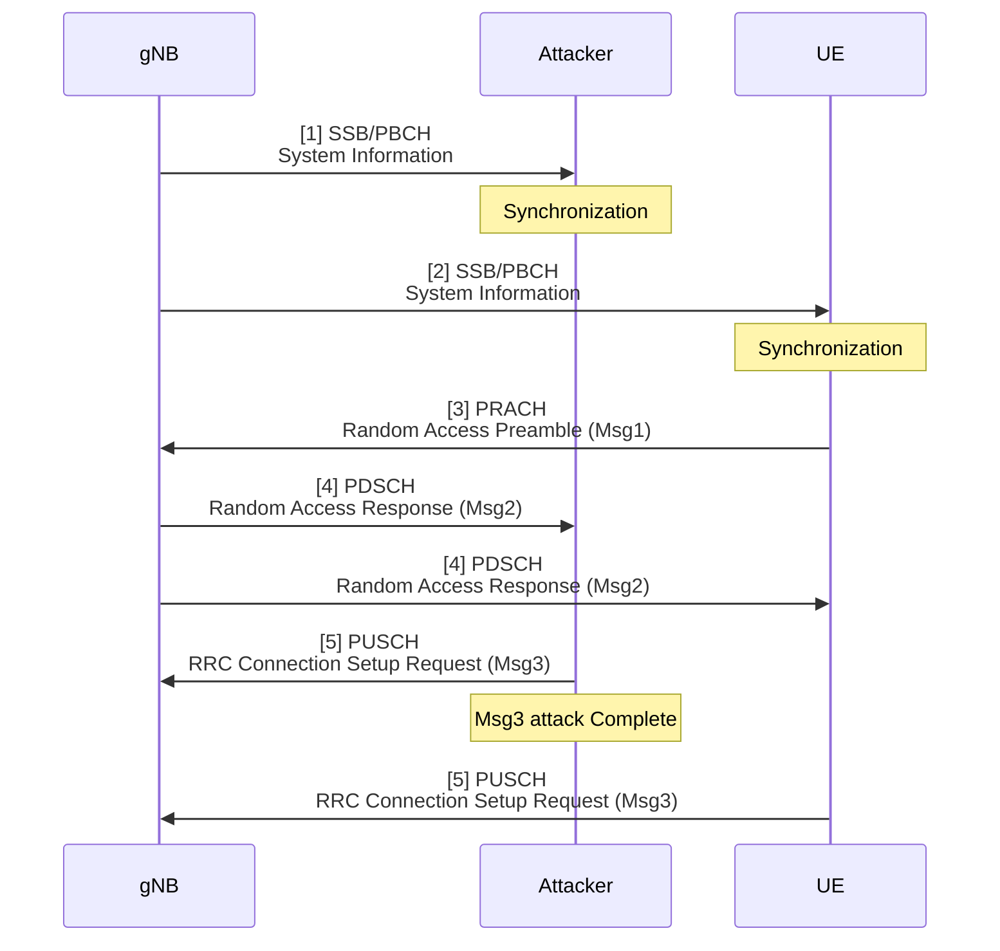
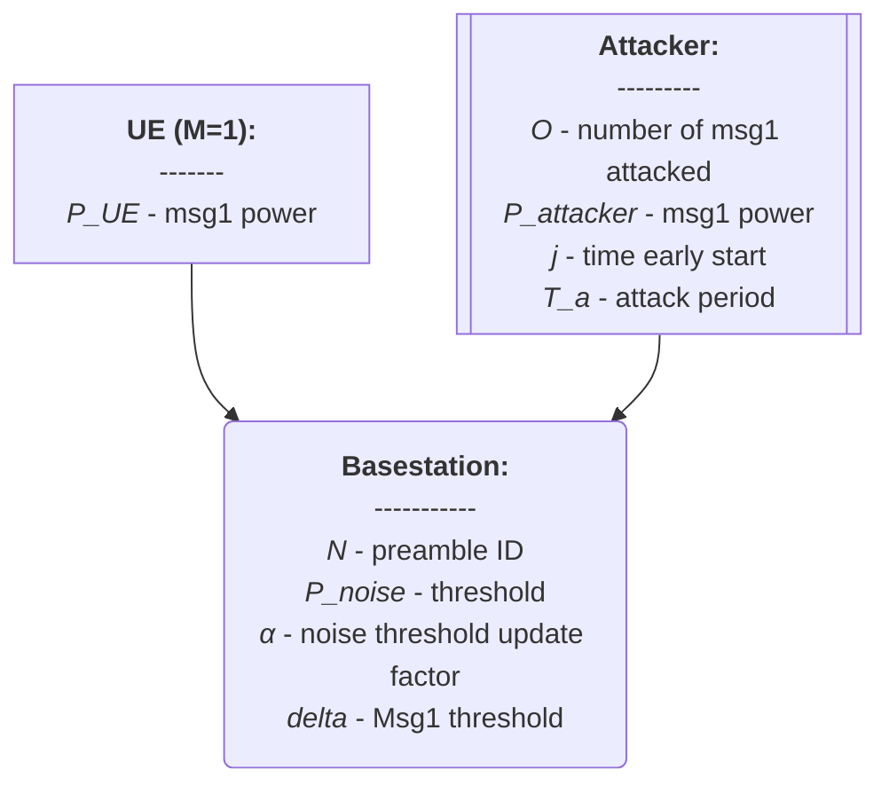
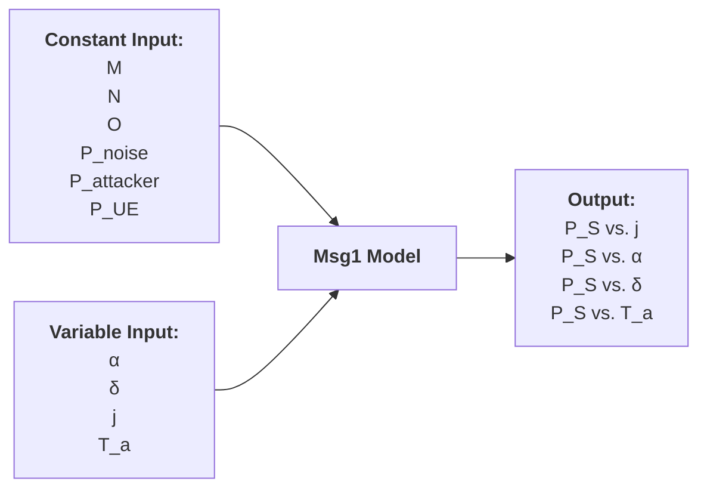

# Thesis (Basic Msg3 Model)

###### tags: `2025`

**Goal:**
- [x] Write Basic Msg3 Model for Analysis of PRACH Attack on Network Energy Saving

**References:**
- Modeling Random Access with Capture and Power Control for IEEE 802.11be Systems
- [Modeling and Estimation of One-Shot Random Access for Finite-User Multichannel Slotted ALOHA Systems](https://ieeexplore.ieee.org/document/6211364)
- [20250307 Thesis (PRACH Attack Problem Definition)](https://github.com/bmw-ece-ntust/wilfrid-prach-attack-analysis/blob/master/docs/20250307%20Thesis%20(PRACH%20Attack%20Problem%20Definition).md)
- [Wireless Communications: Principles and Practice](https://www.amazon.com/Wireless-Communications-Principles-Practice-2nd/dp/0130422320)

**Table of Contents:**
<small><i><a href='http://ecotrust-canada.github.io/markdown-toc/'>Table of contents generated with markdown-toc</a></i></small>

## 1. System Model

### 1.2. PRACH Msg3 Attack Overview


### 1.2. Actors



## 2. Basic Model

### 2.1. Model Parameters

#### 2.1.1. Assumptions or Constant Input Parameter

| Parameter      | Description                    | Constant Value |
| -------------- | ------------------------------ | -------------- |
| $M$            | Number of UE                   | 1              |
| $N$            | Number of Preamble ID          | 64             |
| $O$            | Number of Attacked Preamble ID | 1              |
| $P_{noise}$    | Initial Noise dB Threshold     | (real)         |
| $P_{attacker}$ | Attacker's Msg1 dB Power       | (real)         |
| $P_{UE}$       | UE's Msg1 dB Power             | (real)         |

#### 2.1.2. Variable Input Parameter

| Parameter | Description                                                                                         | Value Range    |
| --------- | --------------------------------------------------------------------------------------------------- | -------------- |
| $i$       | identifier for the ith Random Access Occasion                                                       | 0..∞ (integer) |
| $\alpha$  | Noise update factor parameter                                                                       | 0..1 (real)    |
| $\delta$  | Msg1 to Noise dB Threshold                                                                       | 0..∞ (real)    |
| $j$       | Number of Random Access Occasion early start for attacker relative to UE                            | 0..∞ (integer) |
| $T_a$     | Variability of Attack Period                                                                        | 0..∞ (integer) |

#### 2.1.3. Output Parameter or Performance Metrics

| Parameter | Description                          | Value Range |
| --------- | ------------------------------------ | ----------- |
| $P_S$     | UE's Msg1 Access Success Probability | 0 or 1      |



### 2.2. Model Equation

1. Noise threshold for $RAO = 1$:
```math
P_{noise,1} = P_{noise}
```
2. Noise threshold for $RAO = i$:
```math
P_{noise,i+1} =
\begin{cases} 
(1 - \alpha) * P_{noise,i} + \alpha * P_{attacker}, & \text{if } i > 1 \text{ and } (i-2) \bmod T_a = 0 \\ 
(1 - \alpha) * P_{noise,i} + \alpha * P_{noise}, & \text{otherwise} 
\end{cases}
```
3. Noise threshold for when attacker start early for $j$ RAO is equal to evaluating $P_{noise,i+1}$ over the range $i \in [1, j+1]$ and taking the $P_{noise,j+1}$
4. UE's Msg1 Success with Noise threshold at the $j+1$ RAO is:
```math
P_{S} =
\begin{cases} 
1, & \text{if } P_{UE} > (P_{noise,j+1} + \delta) \text{ and } P_{attacker} \\ 
0, & \text{otherwise} 
\end{cases}
```

### 2.3. Model Implementation in Python Code

#### 2.3.1. Parameters

| Parameter      | Description                                                              | Value   |
| -------------- | ------------------------------------------------------------------------ | ------- |
| $P_{noise}$    | Initial Noise dB Threshold                                               | 17.4      |
| $P_{attacker}$ | Attacker's Msg1 dB Power                                                 | 55      |
| $P_{UE}$       | UE's Msg1 dB Power                                                       | 54      |
| $\alpha$       | Noise update factor parameter                                            | 0.12     |
| $\delta$       | Msg1 to Noise dB Threshold                                               | 12      |
| $j$            | Number of Random Access Occasion early start for attacker relative to UE | 0..41  |
| $T_a$          | Variability of Attack Period                                             | 1,2,4,8 |


#### 2.3.2. Code

```python

```

#### 2.3.3. Result

